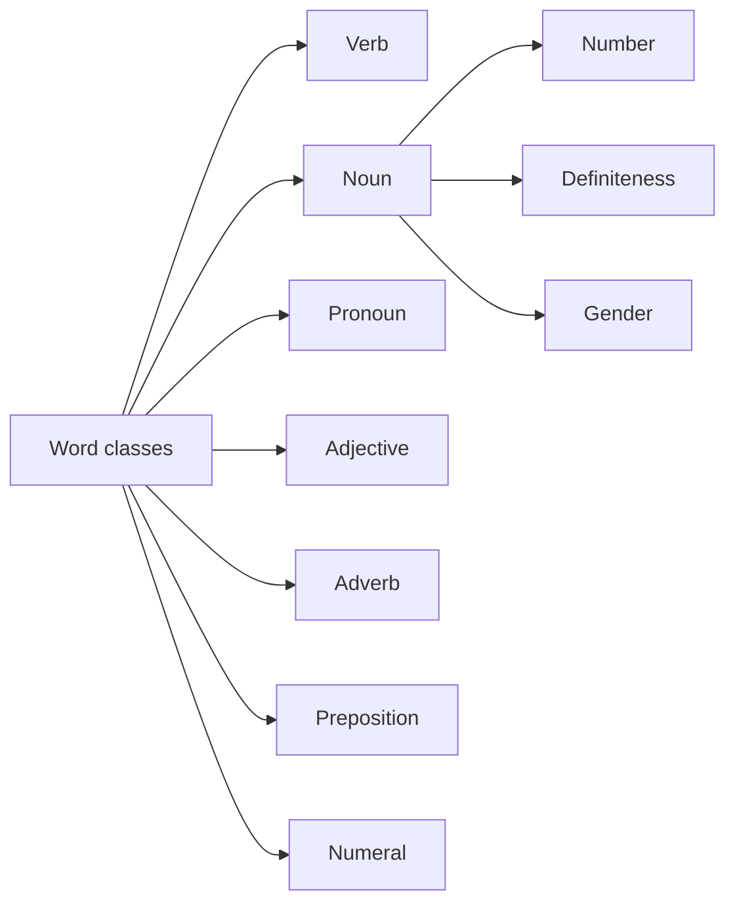

# 02 Word Classes

## 1. Extracted Chapter Text

> [!info] Source text
> Extracted from book pages 12-19. Page markers are retained so the text can be checked against the PDF.

### Page 12

Word classes
In any language there are various kinds of words, each of which follows a
different rule in grammar. To describe this system, words are divided into
word classes or parts o f speech (ordklasser). We have already met one
important word class, the verb. As you saw in 1.2, it stands in a particular
position in question-word questions. A nother typical feature of the verb, as
with the other word classes, is that it changes its form in a particular way with
particular endings.
The verb and its forms
As we have seen, the verb usually describes what someone does or what
happens. In both English and Swedish the verb has different forms according
to when someone does something or something happens. This is done by
means of a change of form called tense (tempus). ‘Tempus’ is in fact the Latin
word for ‘tim e’. This is the most important change of form in the Swedish
verb. The verbs in the following pairs of sentences have different tenses:
Olle arbetar idag. Olle is working today.
Olle arbetade igår. Olle worked yesterday.
Olle dansar nu. Olle is dancing now.
Olle dansade för en timme sedan. Olle danced an hour ago.
Olle duschar nu. Olle is having a shower now.
Olle duschade imorse. Olle had a shower this morning.
In the first sentence in each pair the verb ends in r; in the second sentence in
each pair it ends in de; r and de are two possible endings of the verb. The
ending r shows that something is happening now. This is a tense called the
present (presens). The ending de shows that something happened earlier.
This tense is called the past, or sometimes the preterite (preteritum).
In English both the present and the past tense have two forms: the simple
form and the continuous or progressive form. For example:
Peter plays the piano. Simple present
He is playing the piano now. Continuous present
Ann worked hard yesterday. Simple past
She was working all day. Continuous past
Swedish does not have continuous forms of the verb; it only has the one
simple form of the present and of the past, which end in r and de respectively
and which are used to translate both the simple and the continuous forms in
English.

---

### Page 13

Lisa arbetar nu. Lisa is working now.
Lisa arbetar varje dag. Lisa works every day.
Telefonen ringde klockan 7. The phone rang at 7 o’clock.
Telefonen ringde hela dagen. The phone was ringing the whole day.
As you can see, the Swedish present and past are translated in different ways
according to the context.
W hen you are a beginner, you usually meet a verb in the present form, as
in the following sentence:
Sten cyklar. Sten cycles. (Sten is cycling.)
What do you do if you want to make the equivalent of the following
sentence?
Sten cycled yesterday.
To make that sentence you need to know what ‘yesterday’ is in Swedish. It is
igår. You also need to be able to change the present form of the verb cyklar
into the past form. You do so with the help of the following simple rule:
Past: Take away the r and add de.
Like this:
cyklar—> cykla/ + d e —> cyklade
The sentence you wanted will then look like this:
Sten cyklade igår.
Now try making the past form of the verbs in the following sentences:
Olle pratar. Olle talks. (Olle is talking.)
Olle städar. Olle tidies up. (Olle is tidying up.)
Olle skrattar. Olle laughs. (Olle is laughing.)
The correct answers are, of course:
Olle pratade. Olle talked. (Olle was talking.)
Olle städade. Olle tidied up. (Olle was tidying up.)
Olle skrattade. Olle laughed. (Olle was laughing.)
The problem is that not every verb follows this rule. It is only valid for
verbs which end in ar. These verbs are called ar verbs. But there is another
fairly large group of verbs which end in er, the er verbs. They have a
somewhat different form in the past. Some change their form completely, as
in the last example below:

---

### Page 14

Olle läser. Olle reads. (Olle is reading.)
Olle läste. Olle read. (Olle was reading.)
Olle skriver Olle writes. (Olle is writing.)
Olle skrev. Olle wrote. (Olle was writing.)
Chapter 9 presents the rules for all types of verbs in Swedish. Until you have
studied that chapter, you can use the rule for forming the past of ar verbs.
W hen you come across a different kind of verb, you will, for the time being,
have to learn the past form by heart.
If you look up a verb in a dictionary, it is usually given in the form called
the infinitive (infinitiv). Examples of infinitive forms of verbs in Swedish and
English are: cykla ‘cycle’, prata ‘talk’, and läsa ‘read’.
Usually the infinitive in Swedish ends in a. Unfortunately it is a form that
is not all that useful when you are a beginner. You will probably use the
present to begin with, and it is enough if you learn the verb in that form
when you start to study.
The noun and its forms
Noun (substantiv) is the term for words which denote persons (kvinna
‘woman’, pojke ‘boy’), animals (hund ‘dog’, häst ‘horse’), things (kniv
‘knife’, cykel ‘bicycle’), material (vatten ‘w ater’, järn ‘iron’), and abstract
ideas (skönhet ‘beauty’, styrka ‘strength’). The noun has several characteris­
tic types of endings, which we will present in Chapter 10.
Number
In both Swedish and English the noun has different forms for number
(inumerus).
There are two forms which have the same name in both languages:
singular (singular) and plural (plural). In English most nouns end in s in the
plural. In Swedish there are several different plural endings, which are used
with different types of nouns. The word stol ‘chair’ forms its plural by adding
ar: stol + a r —> stolar ‘chairs’. But bank ‘bank’ forms its plural by adding
er : bank + e r —> banker ‘banks’. There are a few other plural forms, which
will be treated in detail in 10.5. To begin with you can learn the plural forms
of some of the commonest nouns by heart as you come across them.

---

### Page 15

2.4 Definiteness
A noun in Swedish, as in English, is usually accompanied by an article. The
choice between the indefinite article (obestämd artikel) (‘a’, ‘an’; en, ett) and the
definite article (bestämd artikel) (‘the’; -en, -et) follows more or less the same
rules in both languages. One im portant difference, however, is that the
definite article in Swedish is an ending:
IN D EFIN ITE ARTICLE D EFIN ITE ARTICLE
en häst a horse hästen the horse
en katt a cat katten the cat
2.5 Gender: en words and ett words
Unlike English, the Swedish articles have different forms according to the
gender (genus) of the nouns. Let us start with the indefinite article. In
English it has two forms, but the choice between these two forms depends on
the first sound of the following word, for example:
an apple a green apple
an egg a brown egg
When the following word begins with a vowel sound, you use ‘an’, otherwise
‘a ’. The indefinite article in Swedish has two forms as well. With some nouns
it has the form en and with others the form ett:
en stol a chair ett bord a table
en skola a school ett hus a house
en apelsin an orange ett äpple an apple
The choice depends not on the following sound but on the gender of the
noun. Nouns which take en as the indefinite article are called ‘en words’ and
those that take ett are called ‘ett words’. As a rule you have to learn the right
ending for every new noun. When you write new nouns in your note-book,
write them like this:
en banan ett äpple
The idea is that you should learn the noun together with its indefinite article,
because you need to know if a noun is an en word or an ett word to be able to
choose the right form of the definite article and several other grammatical
points. If the indefinite article is ett, the definite article has a form with t (et
or t alone) instead of a form with n (en or n alone):
Sten köper ett äpple och Sten buys an apple and
en banan. a banana.
Han äter äpplet men He eats the apple but not
inte bananen. the banana.

---

### Page 16

The way in which the indefinite and definite forms change according to
whether the noun is an en word or an ett word is shown in the following
table:
‘E N ’ W O R D S ‘E T T ’ W O R D S
Indefinite Definite Indefinite Definite
en banan bananen ett bord bordet
a banana the banana a table the table
en stol stolen ett kök köket
a chair the chair a kitchen the kitchen
en gata gatan ett äpple äpplet
a street the street an apple the apple
As we have already mentioned, you will normally have to learn whether
each noun is an en word or an ett word. There is, however, one type of word
that follows a general rule:
W ords denoting people are en words.
Examples: en man ‘a m an’, en kvinna ‘a woman’, en pojke ‘a boy’, en flicka
‘a girl’. There is, however, one common word that is an exception to this
rule: ett barn ‘a child’.
Personal pronouns
The person that performs an action denoted by a verb can be shown by
words like /, you, he, and she. These words are examples of what are called
personal pronouns (personliga pronomen). They say which person performs
the action. In Swedish the verb does not change its form according to the
person, so, as in English, you must always use a personal pronoun with a
verb, unless there is a noun that stands as the subject and shows who
performs the action.
Jag arbetar. I work.
Du arbetar. You work.
Han arbetar. He works.
Hon arbetar. She works.
Vi arbetar. We work.
Ni arbetar. You work.
De arbetar. They work.
Note that the pronoun jag ‘I’ is only spelt with a capital J when it comes at
the beginning of a sentence. As in English, the pronoun de ‘they’ is the plural
of both ban ‘he’ and hon ‘she’. The pronoun du ‘you’ is nearly always used
when you speak to one person, even if you do not know him or her. The

---

### Page 17

pronoun ni ‘you’ can be used as a polite form of address to one person, but it
is not very common to do so nowadays in Swedish. Ni is always used,
however, when you speak to more than one person.
As in English, the pronouns han ‘he’ and hon ‘she’ are only used about
people (or animals that are thought of as being more or less human). For
animals and things den ‘it’ and det ‘it’ are used. Den is used about things
which are en words and det is used about things which are ett words.
Var är din man? Where is your husband?
Han är där. He is there.
Var är din fru? Where is your wife?
Hon är där. She is there.
Vi har en katt. We have a cat.
Den heter Misse. It is called Misse.
Jag köpte ett äpple. I bought an apple.
Det kostade 2 kronor. It cost 2 kronor.
Britta läser en bok. Britta is reading a book.
Den är bra. It is good.
Olle köpte ett paraply. Olle bought an umbrella.
Det är svart. It is black.
The pronoun de ‘they’ corresponds in the plural to all the following pro­
nouns: han ‘he’, hon ‘she’, den ‘it’, and det ‘it’.
Vad gör K arin och Olle? What are Karin and Olle doing?
De spelar tennis. They are playing tennis.
Sten åt två apelsiner. Sten ate two oranges.
De smakade gott. They tasted good.
Titta på fåglarna! Look at the birds.
De är så vackra. They are so beautiful.
De is pronounced in rather a different way from what you might expect from
the spelling. Usually it is pronounced dom (with a short ‘å ’ sound, see 8 .8 ).
Sometimes you will see this form in writing, too, but it is thought to be rather
informal:
De spelar tennis. = Dom spelar tennis.
In the following table you will find all the pronouns we have described. It
is a good idea to learn them all as quickly as possible:
SINGULAR PLURAL
jag I vi we
du you ni you
han he
hon she
de (dom) they
den it (en words)
det it (ett words)

---

### Page 18

Adjectives
Adjectives (adjektiv) denote qualities, what a person or a thing is like. Some
common adjectives are:
stor big ung young dyr dear, expensive
liten little gammal old billig cheap
An adjective describes a quality in a noun. It can either be put together with
the noun, or after the verb är.
Jag har en gammal bil. I have an old car.
Bilen är gammal. The car is old.
Du har en stor klocka. You have a big watch.
Klockan är stor. The watch is big.
Note that, as in English, the adjective stands directly in front of the noun
when it is together with it.
The adjective changes its form in a special way. This is described in
Chapter 11.
Adverbs
Adverbs (adverb) are rather like adjectives, but they do not describe nouns;
they qualify verbs or adjectives. In the following examples there are adverbs
describing the action denoted by the verb:
Lena stängde dörren snabbt. Lena closed the door quickly.
Per läser tidningen långsamt. Per reads the newspaper slowly.
In Swedish you can often make an adverb from an adjective by adding a t.
The adjective ‘slow’ is långsam in Swedish, and you can make an adverb
from it: långsam + 1 —> långsamt ‘slowly’. Snabbt ‘quickly’ is formed in the
same way: snabb + t —> snabbt. The English ending ly as in ‘slowly’ and
‘quickly’ corresponds closely to the Swedish ending t as in långsamt and
snabbt.
Adverbs can also qualify an adjective. Two common adverbs of this type
are mycket ‘very’ and ganska ‘rather’. In the following examples snabb and
långsam function as adjectives:
Lena har en mycket snabb bil. Lena has a very fast car.
Per är ganska långsam. Per is rather slow.

---

### Page 19

2.9 Prepositions
Prepositions (prepositioner) are small words that are used a great deal in
both Swedish and English. In front of a noun they show, for example, where
or when something happens:
Sten är på kontoret. Sten is at the office.
Bilen står på gatan. The car is in the street.
Eva sitter i bilen. Eva is sitting in the car.
Vi bor i Stockholm. We live in Stockholm.
Vi reser i december. We leave in December.
Per kommer på onsdag. Per is coming on Wednesday.
Although quite a few Swedish prepositions have a corresponding preposition
in English, it is always best to learn a preposition in a phrase:
på gatan in the street
på kontoret at the office
i bilen in the car
i december in December
på onsdag on Wednesday
You can read more about prepositions in 15.3 and 15.4.
2.10 Numerals
The numerals (räkneord) are considered as a separate word-class. A distinc­
tion is made between cardinal numbers (grundtal), which indicate number,
and ordinal numbers (ordningstal), which indicate order. The following are
examples of cardinal numbers:
1 en, ett one 6 sex six
2 två two 7 sju seven
3 tre three 8 åtta eight
4 fyra four 9 nio nine
5 fem five 1 0 tio ten
Första ‘first’ and andra ‘second’ are examples of ordinal numbers.
Första maj är en helgdag The first of May is a public
i Sverige. holiday in Sweden.
With the help of the table on the inside back cover you can form most of the
numerals. It’s well worth your while to try to learn all the cardinal numbers
in particular as quickly as possible.

## 2. Organized Content

### 2 Word Classes

#### Section Navigation

| Section | Topic | Main Point |
|---|---|---|
| 02.01 The Verb and Its Forms|2.1 The verb and its forms | Verbs | Swedish verbs mark tense but not continuous aspect. |
| 02.02 The Noun and Its Forms|2.2 The noun and its forms | Nouns | Nouns denote people, animals, things, materials, and ideas. |
| 02.03 Number|2.3 Number | Singular and plural | Swedish has several plural endings. |
| 02.04 Definiteness|2.4 Definiteness | Articles | The Swedish definite article is usually an ending. |
| 02.05 Gender En Words and Ett Words|2.5 Gender: en words and ett words | Gender | Nouns are learned as `en` words or `ett` words. |
| 02.06 Personal Pronouns|2.6 Personal pronouns | Pronouns | Pronouns show person and agree with noun gender for `it`. |
| 02.07 Adjectives|2.7 Adjectives | Adjectives | Adjectives describe qualities and can stand before nouns or after `är`. |
| 02.08 Adverbs|2.8 Adverbs | Adverbs | Adverbs qualify verbs or adjectives. |
| 02.09 Prepositions|2.9 Prepositions | Prepositions | Prepositions are best learned in phrases. |
| 02.10 Numerals|2.10 Numerals | Numbers | Cardinal and ordinal numbers form a separate word class. |

#### Chapter Map



#### Key Terms

| English | Swedish | Chinese |
|---|---|---|
| word class / part of speech | ordklass | 词类 |
| verb | verb | 动词 |
| tense | tempus | 时态 |
| present | presens | 现在时 |
| past / preterite | preteritum | 过去时 |
| infinitive | infinitiv | 不定式 |
| noun | substantiv | 名词 |
| number | numerus | 数 |
| singular | singular | 单数 |
| plural | plural | 复数 |
| definite article | bestämd artikel | 定冠词 |
| indefinite article | obestämd artikel | 不定冠词 |
| gender | genus | 性 |
| personal pronoun | personligt pronomen | 人称代词 |
| adjective | adjektiv | 形容词 |
| adverb | adverb | 副词 |
| preposition | preposition | 介词 |
| numeral | räkneord | 数词 |

### 2.1 The Verb and Its Forms

#### Present And Past

| Swedish | English |
|---|---|
| Olle arbetar idag. | Olle is working today. |
| Olle arbetade igår. | Olle worked yesterday. |
| Olle dansar nu. | Olle is dancing now. |
| Olle dansade för en timme sedan. | Olle danced an hour ago. |
| Olle duschar nu. | Olle is having a shower now. |
| Olle duschade imorse. | Olle had a shower this morning. |

#### Main Rule Introduced

For many beginner-level `-ar` verbs, the past tense is made by removing final `-r` from the present and adding `-de`.

```text
cyklar -> cykla + de -> cyklade
```

| Present | Past | English |
|---|---|---|
| cyklar | cyklade | cycles / cycled |
| pratar | pratade | talks / talked |
| städar | städade | tidies / tidied |
| skrattar | skrattade | laughs / laughed |

#### Limits Of The Rule

Not every verb follows this `-ar` pattern. Swedish also has `-er` verbs and verbs that change more strongly.

| Present | Past | English |
|---|---|---|
| läser | läste | reads / read |
| skriver | skrev | writes / wrote |

The full system is treated later in Chapter 9. At this stage, the section recommends learning unfamiliar past forms by heart when they do not follow the beginner rule.

#### Infinitive

In dictionaries, verbs usually appear in the infinitive form.

| Infinitive | English |
|---|---|
| cykla | cycle |
| prata | talk |
| läsa | read |

Swedish infinitives usually end in `-a`, but beginners often meet and use the present form first.

### 2.2 The Noun and Its Forms

#### What Nouns Can Denote

| Category | Swedish Examples | English |
|---|---|---|
| Persons | kvinna, pojke | woman, boy |
| Animals | hund, häst | dog, horse |
| Things | kniv, cykel | knife, bicycle |
| Materials | vatten, järn | water, iron |
| Abstract ideas | skönhet, styrka | beauty, strength |

#### Key Point

Nouns have several characteristic types of endings. These endings are important because they can express number, definiteness, gender-related article patterns, and other noun forms.

### 2.3 Number

#### Singular And Plural

| English Term | Swedish Term | Meaning |
|---|---|---|
| singular | singular | one |
| plural | plural | more than one |

#### Plural Endings

| Singular | Plural | English |
|---|---|---|
| stol | stolar | chair / chairs |
| bank | banker | bank / banks |

The section notes that Swedish has several plural endings. They are treated in detail in section 10.5. At the beginner stage, common plural forms should be learned as they appear.

### 2.4 Definiteness

#### Indefinite And Definite Forms

| Form | Swedish | English |
|---|---|---|
| Indefinite | en häst | a horse |
| Definite | hästen | the horse |
| Indefinite | en katt | a cat |
| Definite | katten | the cat |

#### Key Rule

In Swedish, the definite article often appears as a suffix:

```text
en häst -> hästen
en katt -> katten
```

### 2.5 Gender: En Words And Ett Words

#### Indefinite Articles

| En Words | English | Ett Words | English |
|---|---|---|---|
| en stol | a chair | ett bord | a table |
| en skola | a school | ett hus | a house |
| en apelsin | an orange | ett äpple | an apple |

#### Definite Forms

| En Words | English | Ett Words | English |
|---|---|---|---|
| en banan -> bananen | a banana -> the banana | ett bord -> bordet | a table -> the table |
| en stol -> stolen | a chair -> the chair | ett kök -> köket | a kitchen -> the kitchen |
| en gata -> gatan | a street -> the street | ett äpple -> äpplet | an apple -> the apple |

#### Practical Learning Rule

Most nouns must be learned together with their indefinite article:

```text
en banan
ett äpple
```

One useful generalization is that words denoting people are usually `en` words.

| En Word | English |
|---|---|
| en man | a man |
| en kvinna | a woman |
| en pojke | a boy |
| en flicka | a girl |

Exception noted in the chapter:

| Ett Word | English |
|---|---|
| ett barn | a child |

### 2.6 Personal Pronouns

#### Subject Pronouns

| Swedish | English | Notes |
|---|---|---|
| jag | I | Capitalized only at the beginning of a sentence. |
| du | you | Normally used for one person. |
| han | he | Used for people and human-like animals. |
| hon | she | Used for people and human-like animals. |
| den | it | Used for `en` words. |
| det | it | Used for `ett` words. |
| vi | we | Plural. |
| ni | you | Used for more than one person; rare as polite singular. |
| de / dom | they | `dom` is common in speech and informal writing. |

#### Examples With Verbs

| Swedish | English |
|---|---|
| Jag arbetar. | I work. |
| Du arbetar. | You work. |
| Han arbetar. | He works. |
| Hon arbetar. | She works. |
| Vi arbetar. | We work. |
| Ni arbetar. | You work. |
| De arbetar. | They work. |

#### Den And Det

`den` and `det` are used for animals and things according to noun gender.

| Swedish Context | Pronoun | English |
|---|---|---|
| en katt | Den heter Misse. | It is called Misse. |
| ett äpple | Det kostade 2 kronor. | It cost 2 kronor. |
| en bok | Den är bra. | It is good. |
| ett paraply | Det är svart. | It is black. |

#### De

`de` is the plural counterpart of `han`, `hon`, `den`, and `det`.

| Swedish | English |
|---|---|
| De spelar tennis. | They are playing tennis. |
| De smakade gott. | They tasted good. |
| De är så vackra. | They are so beautiful. |

### 2.7 Adjectives

#### Common Adjectives

| Swedish | English | Swedish | English |
|---|---|---|---|
| stor | big | ung | young |
| dyr | dear, expensive | liten | little |
| gammal | old | billig | cheap |

#### Two Positions

| Swedish | English | Position |
|---|---|---|
| Jag har en gammal bil. | I have an old car. | Before the noun |
| Bilen är gammal. | The car is old. | After `är` |
| Du har en stor klocka. | You have a big watch. | Before the noun |
| Klockan är stor. | The watch is big. | After `är` |

When an adjective is together with a noun, it stands directly before the noun, as in English. The adjective changes form in a special way, which is treated in Chapter 11.

### 2.8 Adverbs

#### Adverbs Qualifying Verbs

| Swedish | English |
|---|---|
| Lena stängde dörren snabbt. | Lena closed the door quickly. |
| Per läser tidningen långsamt. | Per reads the newspaper slowly. |

#### Forming Adverbs From Adjectives

| Adjective | Adverb | English |
|---|---|---|
| långsam | långsamt | slow / slowly |
| snabb | snabbt | quick / quickly |

The Swedish ending `-t` often corresponds to English `-ly` in adverbs such as `slowly` and `quickly`.

#### Adverbs Qualifying Adjectives

| Swedish | English |
|---|---|
| Lena har en mycket snabb bil. | Lena has a very fast car. |
| Per är ganska långsam. | Per is rather slow. |

| Swedish Adverb | English |
|---|---|
| mycket | very |
| ganska | rather |

### 2.9 Prepositions

#### Examples In Sentences

| Swedish | English |
|---|---|
| Sten är på kontoret. | Sten is at the office. |
| Bilen står på gatan. | The car is in the street. |
| Eva sitter i bilen. | Eva is sitting in the car. |
| Vi bor i Stockholm. | We live in Stockholm. |
| Vi reser i december. | We leave in December. |
| Per kommer på onsdag. | Per is coming on Wednesday. |

#### Learn Prepositions In Phrases

| Swedish Phrase | English |
|---|---|
| på gatan | in the street |
| på kontoret | at the office |
| i bilen | in the car |
| i december | in December |
| på onsdag | on Wednesday |

More detailed treatment appears in sections 15.3 and 15.4.

### 2.10 Numerals

#### Cardinal Numbers

| Number | Swedish | English |
|---:|---|---|
| 1 | en, ett | one |
| 2 | två | two |
| 3 | tre | three |
| 4 | fyra | four |
| 5 | fem | five |
| 6 | sex | six |
| 7 | sju | seven |
| 8 | åtta | eight |
| 9 | nio | nine |
| 10 | tio | ten |

#### Ordinal Numbers

| Swedish | English |
|---|---|
| första | first |
| andra | second |

#### Example

| Swedish | English |
|---|---|
| Första maj är en helgdag i Sverige. | The first of May is a public holiday in Sweden. |

The section recommends learning the cardinal numbers as quickly as possible.

## 3. Summary

### 2 Word Classes

##### 中文总结

第 2 章建立瑞典语基础词类框架。动词的重点是时态和词尾；名词的重点是数、定性和 `en/ett` 性别；代词、形容词、副词、介词和数词则为后续句法规则提供基本材料。

##### 学习建议

- 新学名词时同时记 `en/ett` 和复数形式。
- 新学动词时先记现在时，再补过去时和不定式。
- 介词不要孤立记，优先记短语，如 `i Stockholm`, `på onsdag`。

### 2.1 The Verb and Its Forms

##### 中文总结

本节说明瑞典语动词主要通过形式变化表达时态。`-ar` 动词可先用 `去掉 r + de` 的方法构成过去时，如 `cyklar -> cyklade`。但不是所有动词都这样变化，`-er` 动词和不规则动词需要另记。

##### 检查点

- 是否能区分 present、past、infinitive？
- 是否能把 `pratar / städar / skrattar` 改成过去时？
- 是否知道瑞典语没有英语那种独立的 continuous verb form？

### 2.2 The Noun and Its Forms

##### 中文总结

名词 `substantiv` 表示人、动物、事物、材料和抽象概念。本节只是定义名词并预告：名词的具体词尾变化会在第 10 章详细处理。

##### 检查点

- 是否能说明 noun 的基本功能？
- 是否能把 `kvinna / hund / vatten / skönhet` 分到正确类别？
- 是否知道名词后续要学习词尾变化？

### 2.3 Number

##### 中文总结

瑞典语名词和英语一样有单数、复数，但复数词尾不只一种。`stol -> stolar` 和 `bank -> banker` 展示了两种不同复数形式。

##### 检查点

- 是否能解释 `singular / plural`？
- 是否知道瑞典语复数不只有一个统一词尾？
- 是否能记住 `stol -> stolar`, `bank -> banker`？

### 2.4 Definiteness

##### 中文总结

瑞典语也区分 indefinite 和 definite。关键差异是：英语的 `the` 放在名词前，而瑞典语定冠词通常作为词尾加在名词后，如 `en häst -> hästen`。

##### 检查点

- 是否能区分 indefinite article 和 definite article？
- 是否能解释 `hästen` 为什么等于 `the horse`？
- 是否记住 Swedish definite article is often an ending？

### 2.5 Gender: En Words And Ett Words

##### 中文总结

瑞典语名词有 `en` 和 `ett` 两类。新学名词时必须连冠词一起记，因为它会影响定冠词形式和其他语法形式。表示人的词通常是 `en`，但 `ett barn` 是常见例外。

##### 检查点

- 是否能区分 `en word` 和 `ett word`？
- 是否能把 `en banan -> bananen`, `ett äpple -> äpplet` 写出来？
- 是否知道新名词必须和冠词一起背？

### 2.6 Personal Pronouns

##### 中文总结

瑞典语动词不随人称变化，所以主语代词很重要。`den` 用于 `en` 词，`det` 用于 `ett` 词；复数统一用 `de`，口语常读作并写作 `dom`。

##### 检查点

- 是否能背出 `jag, du, han, hon, den, det, vi, ni, de`？
- 是否知道 `den/det` 和名词 `en/ett` 有关？
- 是否知道 `jag` 不像英语 `I` 那样总是大写？

### 2.7 Adjectives

##### 中文总结

形容词表示性质，可以放在名词前，也可以放在 `är` 后。形容词本身会有形式变化，但细节在第 11 章处理。

##### 检查点

- 是否能解释 adjective 的功能？
- 是否能区分 `en gammal bil` 和 `Bilen är gammal`？
- 是否记住形容词变化留到第 11 章系统学习？

### 2.8 Adverbs

##### 中文总结

副词修饰动词或形容词。瑞典语中很多副词可由形容词加 `-t` 构成，如 `snabb -> snabbt`。`mycket` 和 `ganska` 可修饰形容词。

##### 检查点

- 是否能解释 adverb 与 adjective 的区别？
- 是否能用 `snabb -> snabbt`, `långsam -> långsamt` 造句？
- 是否知道 `mycket` 和 `ganska` 的作用？

### 2.9 Prepositions

##### 中文总结

介词非常常用，常用来表达地点或时间。不要孤立背 `på` 或 `i`，而要背短语，如 `på gatan`, `i bilen`, `på onsdag`。

##### 检查点

- 是否能解释 preposition 的功能？
- 是否能记住至少 5 个介词短语？
- 是否知道介词更多内容会在第 15 章展开？

### 2.10 Numerals

##### 中文总结

数词 `räkneord` 分为基数词 `grundtal` 和序数词 `ordningstal`。本节重点是 1-10 的基数词，以及 `första`, `andra` 这样的序数词。

##### 检查点

- 是否能背出 1-10 的瑞典语？
- 是否知道 `en/ett` 都可表示 one？
- 是否能区分 cardinal number 和 ordinal number？
