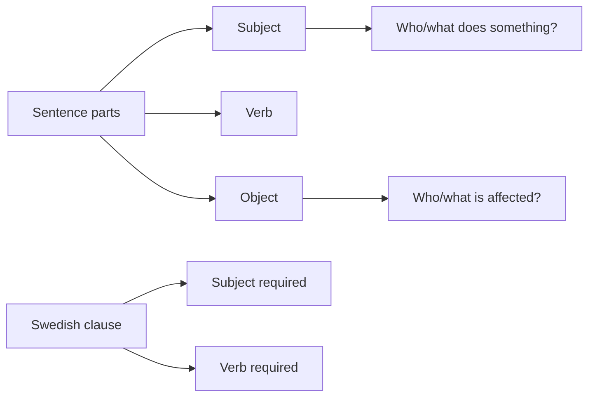

# 03 Subject Verb and Object

## 1. Extracted Chapter Text

> [!info] Source text
> Extracted from book pages 20-22. Page markers are retained so the text can be checked against the PDF.

### Page 20

Subject, verb and object
The parts of a sentence
We have talked about word classes and now we must go on to look at the
parts of a sentence. In Swedish a word normally belongs to a particular word
class; this can be looked upon as an integral feature of a word. Words like
jägare ‘hunter’ (person), lejon ‘lion’ (animal) and gevär ‘gun’ (thing) are, for
example, always nouns in Swedish. Note that this distinction is not quite so
clear in English. The word ‘gun’, for example, can be a verb as well as a
noun.
But nouns can play different roles in a sentence. The following sentences
have quite different meanings although they use the same nouns and the
same verb:
The hunter killed the lion.
The lion killed the hunter.
You can think of these sentences as little scenes in which the nouns play
different roles. These different roles are called the parts o f a sentence
(satsdelar). The part of a sentence indicates what role a noun plays in a
particular sentence, while the word class can be established for most Swedish
words in isolation.
In the sentence ‘The hunter killed the lion’ it is the hunter that does
something - he kills the lion. The person or thing that does something is
called the subject (subjekt). There is also someone or something that is
affected by what the subject does. In the sentence above it is the lion; it gets
killed. The person or thing that the subject does something to is called the
object (objekt). In the sentence ‘The lion killed the hunter’ the roles are
reversed: here the lion is the subject and the hunter is the object.
You can often check what is the subject and what is the object of a
sentence by asking questions. You can find the subject by asking questions
like: Who is doing (did) something? What is doing (did) something?:
WholWhat did something?
The hunter killed the lion. The hunter (= the subject)
The lion killed the hunter. The lion (= the subject)
Peter kissed Mary. Peter (= the subject)
Mary kissed Peter. Mary (= the subject)
You can find the object by asking a question that contains the subject and
the verb. This gives you questions like ‘W hat did the hunter kill?’, ‘Who did
Peter kiss?’

---

### Page 21

Answer
Question (= the object)
The hunter killed the lion. W hat did the hunter kill? The lion.
Peter kissed Mary. Who did Peter kiss? Mary.
The lion killed the hunter. Who did the lion kill? The hunter.
Mary kissed Peter. Who did Mary kiss? Peter.
3.2 Subject, object and word order in Swedish
When you make a sentence in Swedish, as in English, you normally have the
word order SUBJECT + VERB + OBJECT. D on’t use a different word
order until you have learnt the rule that says you may do so. (You will be
given several such rules later on.) To make sentences in Swedish you can use
the following table:
SUBJECT VERB OBJECT
Jägaren dödade lejonet.
The hunter killed the lion.
Lejonet dödade jägaren.
The lion killed the hunter.
Eva skriver ett brev.
Eva is writing a letter.
Olle läser tidningen
Olle is reading the newspaper.
Familjen Nygren äter middag.
The Nygrens are having dinner.
Olle spelar tennis.
Olle is playing tennis.
Some verbs only have a subject and no object. You can make this type of
sentence with the same table, but the object position will be empty.
SUBJECT VERB OBJECT
Sten väntar.
Sten is waiting.
Olle arbetar.
Olle is working.
Karin sjunger.
Karin is singing.

---

### Page 22

3.3 Subject-verb constraint*
In Swedish, as in English, all clauses must contain a subject and a verb. This
rule is called the subject-verb constraint or place-holder constraint (platshål-
lartvång). In many languages it is possible to leave out the subject if it is a
pronoun like I, you, we etc., but it is not possible in Swedish:
Jag sover bra. I sleep well.
Vi reser hem imorgon. We are going home tomorrow.
In Swedish there is also, just as in English, an ‘empty’ subject which does not
refer to anything particular. It is the pronoun det ‘it’ which is, for example,
used before verbs that describe the weather:
Det regnar. It is raining.
D et snöar. It is snowing.
D et blåser. It is windy.
D et är kallt ute. It is cold out.
D et är varmt inne. It is w'arm indoors.
As det ‘it’ does not refer to anything particular, it is called the form al subject
(formellt subjekt).
There are also languages which, in certain cases, leave out the verb,
especially the verb ‘be’. H ere too, however, Swedish and English are alike;
both languages always use a verb:
Per är hungrig. Per is hungry.
To remind you that there must always be a subject and a verb in a Swedish
sentence or clause, the subject and the verb will be marked in the tables that
describe word order, like this:
SUBJECT VERB OBJECT
kommer.
regnar.
spelar tennis.
Karin läser tidningen.
Karin is reading the paper.
* This section is mainly for those whose native language is not English.

## 2. Organized Content

### 3 Subject, Verb And Object

#### Section Navigation

| Section | Topic | Main Point |
|---|---|---|
| 03.01 The Parts of a Sentence|3.1 The parts of a sentence | Sentence roles | Subject and object are roles in a sentence. |
| 03.02 Subject Object and Word Order in Swedish|3.2 Subject, object and word order in Swedish | Basic word order | Swedish normally uses `Subject + Verb + Object`. |
| 03.03 Subject Verb Constraint|3.3 Subject-verb constraint | Required positions | Swedish clauses must contain a subject and a verb. |

#### Chapter Map



### 3.1 The Parts Of A Sentence

#### Word Class Vs Sentence Part

| Concept | Swedish | What It Tells You |
|---|---|---|
| word class | ordklass | What kind of word it is. |
| part of a sentence | satsdel | What role the word or phrase has in a sentence. |

Examples such as `jägare`, `lejon`, and `gevär` are nouns in Swedish, but nouns can still take different sentence roles.

#### Subject And Object

| Sentence | Subject | Object | Meaning |
|---|---|---|---|
| The hunter killed the lion. | the hunter | the lion | The hunter does the action. |
| The lion killed the hunter. | the lion | the hunter | The lion does the action. |

The person or thing that does something is the subject. The person or thing affected by what the subject does is the object.

#### Question Tests

You can often find the subject by asking:

```text
Who/what did something?
```

| Sentence | Subject Question | Subject |
|---|---|---|
| The hunter killed the lion. | Who killed the lion? | The hunter |
| The lion killed the hunter. | Who killed the hunter? | The lion |
| Peter kissed Mary. | Who kissed Mary? | Peter |
| Mary kissed Peter. | Who kissed Peter? | Mary |

You can often find the object by asking a question that contains the subject and the verb.

| Sentence | Object Question | Object |
|---|---|---|
| The hunter killed the lion. | What did the hunter kill? | The lion |
| Peter kissed Mary. | Who did Peter kiss? | Mary |
| The lion killed the hunter. | Who did the lion kill? | The hunter |
| Mary kissed Peter. | Who did Mary kiss? | Peter |

### 3.2 Subject, Object And Word Order In Swedish

#### Basic Word Order

```text
Subject + Verb + Object
```

| Subject | Verb | Object | English |
|---|---|---|---|
| Jägaren | dödade | lejonet. | The hunter killed the lion. |
| Lejonet | dödade | jägaren. | The lion killed the hunter. |
| Eva | skriver | ett brev. | Eva is writing a letter. |
| Olle | läser | tidningen. | Olle is reading the newspaper. |
| Familjen Nygren | äter | middag. | The Nygrens are having dinner. |
| Olle | spelar | tennis. | Olle is playing tennis. |

#### Verbs Without Objects

Some verbs only need a subject and a verb. The object position is then empty.

| Subject | Verb | Object | English |
|---|---|---|---|
| Sten | väntar. |  | Sten is waiting. |
| Olle | arbetar. |  | Olle is working. |
| Karin | sjunger. |  | Karin is singing. |

### 3.3 Subject-Verb Constraint

#### Required Subject And Verb

| Swedish | English |
|---|---|
| Jag sover bra. | I sleep well. |
| Vi reser hem imorgon. | We are going home tomorrow. |

Swedish cannot normally omit subject pronouns like `jag` or `vi` in this type of clause.

#### Formal Subject Det

Swedish also uses an empty or formal subject `det`, especially in weather expressions.

| Swedish | English |
|---|---|
| Det regnar. | It is raining. |
| Det snöar. | It is snowing. |
| Det blåser. | It is windy. |
| Det är kallt ute. | It is cold out. |
| Det är varmt inne. | It is warm indoors. |

Since this `det` does not refer to a specific thing, it is called a formal subject.

#### Verb Requirement

Swedish, like English, normally includes a verb even where some languages may omit the equivalent of `be`.

| Swedish | English |
|---|---|
| Per är hungrig. | Per is hungry. |

#### Word-Order Reminder

The book marks the subject and verb positions in word-order tables because both positions are required in a Swedish clause.

| Subject | Verb | Object |
|---|---|---|
| Karin | läser | tidningen. |

## 3. Summary

### 3 Subject, Verb And Object

##### 中文总结

第 3 章从词类转向句子成分。名词本身属于词类，但在具体句子中可以承担主语或宾语等角色。瑞典语基础陈述句通常采用 `Subject + Verb + Object`，并且句子或分句必须有主语和动词。

##### 学习建议

- 先判断词类，再判断句子成分。
- 用问题法找主语和宾语：谁做了动作？动作影响了谁？
- 造句时先使用基础词序，不要提前使用特殊词序。

### 3.1 The Parts Of A Sentence

##### 中文总结

词类说明一个词本身属于什么类型；句子成分说明这个词或短语在句子中承担什么角色。主语是做动作的人或事物，宾语是受到动作影响的人或事物。

##### 检查点

- 是否能区分 `word class` 和 `part of a sentence`？
- 是否能用问题法找 subject？
- 是否能用问题法找 object？

### 3.2 Subject, Object And Word Order In Swedish

##### 中文总结

瑞典语普通陈述句通常使用 `Subject + Verb + Object`。有些动词不需要宾语，因此只出现主语和动词。初学阶段不要随意改变词序，除非已经学到相应规则。

##### 检查点

- 是否能写出 `Subject + Verb + Object`？
- 是否能区分有宾语句和无宾语句？
- 是否能用表格分析瑞典语句子的词序？

### 3.3 Subject-Verb Constraint

##### 中文总结

瑞典语分句必须有主语和动词。天气句中的 `det` 是形式主语，不指具体事物，但仍然占据主语位置。瑞典语也不能随意省略 `är` 这类动词。

##### 检查点

- 是否知道瑞典语分句必须有 subject 和 verb？
- 是否能解释 formal subject `det`？
- 是否能造出一个天气句和一个普通主谓句？
