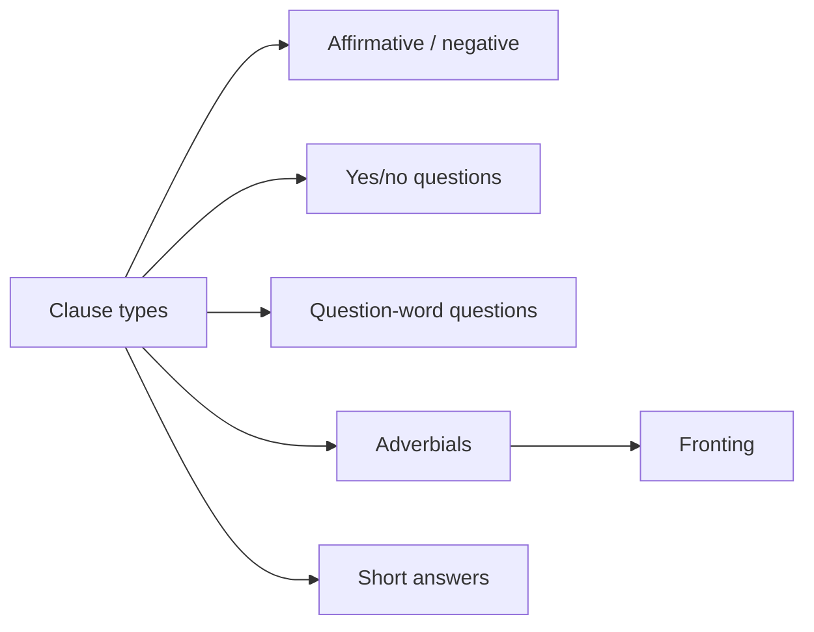

# 04 Various Types of Clause

## 1. Extracted Chapter Text

> [!info] Source text
> Extracted from book pages 23-30. Page markers are retained so the text can be checked against the PDF.

### Page 23

Various types o f clause
Clause negation: inte
Clauses may be affirmative clauses or negative clauses. With many verbs
English uses the dummy verb ‘do’ + ‘not’ to form negative clauses. In
Swedish only one word is used, inte, which always has the same form:
Affirmative clause Negative clause
Jag dricker kaffe. Hon dricker inte kaffe.
I drink coffee. She does not drink coffee.
Per tycker om te. Lena tycker inte om te.
Per likes tea. Lena does not like tea.
The word inte is placed directly after the verb.
X V
SUBJECT VERB inte OBJECT
Sten cyklar.
Sten cycles.
Olle cyklar inte.
Olle does not cycle.
Britta äter frukost.
Britta has breakfast.
Karin äter inte frukost.
Karin does not have breakfast.
Det regnar.
It is raining.
Det snöar inte.
It is not snowing.
Thus it is much easier to make negative clauses in Swedish than it is in
English.
Yes/no questions
A distinction is also made between statements and questions. A statem ent is
used when you want to tell someone something. A question is used when you
want to find out something. Depending on what kind of verb there is in the
sentence, you make a question in English either by putting the dummy verb
‘do’ in front of the subject or by putting the auxiliary verb in front of the
subject:
Statement Question
John likes fish. Does John like fish?
You can speak Swedish. Can you speak Swedish?

---

### Page 24

You can answer questions like these with ‘Yes’ or ‘No’, so they are called
yeslno questions (jalnej-frågor). As we saw in 1.2 there is another type of
question that begins with a question word. This type is called a question-
word question (frågeordsfråga). We shall deal with them in the next section.
In Swedish you show that a sentence is a question simply by putting the
verb at the beginning of the sentence. The subject always comes directly
after the verb. No other word is needed.
VERB SUBJECT OBJECT
A rbetar Elsa?
Does Elsa work?
Kör hon buss?
Does she drive a bus?
Skriver Josefin?
Does Josefin write?
Skriver hon brev?
Does she write letters?
Gillar du musik?
Do you like music?
Regnar det?
Is it raining?
Ser du Per?
Can you see Per?
Question-word questions
Question-word questions are questions you cannot answer with ‘Yes’ or
‘N o’. Imagine a situation which can be described with the following sen­
tence:
Sten äter ett äpple i köket Sten eats an apple in the kitchen
på morgonen. in the morning.
Questions and answers of the following kinds are then possible:
Question-word questions Answers
Vad gör Sten? Han äter.
What does Sten do? He eats.
Vem äter? Sten.
Who eats? Sten.
Vad äter han? Ett äpple.
W hat does he eat? An apple.
Var äter han? I köket.
W here does he eat? In the kitchen.
När äter han? På morgonen
When does he eat? In the morning.

---

### Page 25

Just as in English the question word always comes first in the sentence. But
in Swedish you must always put the subject directly after the verb. No other
words are needed.
Always follow the word order in the table:
Q-W ORD VERB SUBJECT O BJECT
Var bor Josefin?
W here does Josefin live?
Vad heter du?
What is your name?
Var äter Kalle middag?
Where does Kalle have supper?
När sålde du bilen?
When did you sell the car?
När regnade det?
When did it rain?
Note that just as in statements there must be a subject in the question. The
subject position in the table is empty only when the question word itself is
the subject, as in the following questions:
Q-W ORD VERB SUBJECT OBJECT
Vem bakar bröd?
Who is baking bread?
Vad hände?
What happened?
Note, too, that the question words do not have different forms in Swedish.
The only question word that can change its form in English is ‘who’, which
can have the form ‘whom’ when it is the object. But most English people use
the form ‘who’ for subject and object, just as Swedish uses vem:
Vem ser du? Who (Whom) can you see?
Vem vet svaret? Who knows the answer?
Vad är bäst? What is best?
Vad köpte du? What did you buy?
4.4 Question words
The most important question words have already been described above.
They are repeated in the following list, which also contains a few other, more
special question words that it will pay you to learn as you come across them.

---

### Page 26

vem is used when you ask about a person, just like ‘who’ in English. Vem
corresponds to both ‘who’ and ‘whom’.
Vem står därborta? Who is standing over there?
Vem träffade du igår? Who (Whom) did you meet yesterday?
vems is used when you ask about the owner of something, just like ‘whose’ in
English.
Vems cykel lånade du? Whose bicycle did you borrow?
The plural of vem is vilka:
Vilka kommer i kväll? Who are coming this evening?
vad is used when you ask about things. It has only one form, just like ‘what’
in English.
Vad irriterar dig så? What is irritating you so much?
Vad köpte Olle? W hat did Olle buy?
Vad sa han? W hat did he say?
The following question words are used to ask about place:
var ‘where’
Var bor du? W here do you live?
Var är tvålen? W here is the soap?
vart ‘where’, in the sense of ‘where to ’. That is, when destination and not
position is referred to.
Vart reste ni på semestern? WTiere did you go for your holiday?
Vart tog han vägen? W here did he go to?
varifrån ‘where . . . from ’
Varifrån kommer du? Where do you come from?
när ‘when’ is the most important question word for asking about a point in
time:
När tvättade du fönstren? When did you clean the windows?
När dog Napoleon? When did Napoleon die?
hur dags can be used instead of när when you expect the answer to be clock
time; in English you can ask ‘W hat time’ instead of ‘W hen’:
När vaknade du imorse? When did you wake up this morning?
Hur dags vaknade du imorse? What time did you wake up
this morning?
Klockan sju. (A t) seven o’clock.
varför ‘why’ is used when you ask about the reason for something:
Varför ljög du? Why did you tell a lie?
Varför gråter Sten? Why is Sten crying?

---

### Page 27

hur ‘how1 is used when you ask about the way something is done:
Hur kom du till Sverige? How did you get to Sweden?
H ur gör man ost? How do you make cheese?
There are also many special question phrases that begin with hur:
hur mycket ‘how much’
H ur mycket kostar potatisen? How much do the potatoes cost?
H ur mycket är klockan? What time is it?
Instead of hur mycket you can use vad:
Vad kostar potatisen? W hat do the potatoes cost?
Vad är klockan? What is the time?
hur långt ‘how far’
H ur långt är det till skolan? How far is it to school?
hur länge ‘how long’
Hur länge var du i England? How long were you in England?
hur ofta ‘how often’
H ur ofta går du på bio? How often do you go to the cinema?
hur dags ‘when’, see above.
4.5 Another part of the sentence: adverbials
You often want to say where or when something happens. For this you use an
adverbial (adverbial). Normally the adverbial comes after the object in
Swedish. Do not use a different word order until you have learnt a special
rule that says you may do so.
SUBJECT VERB OBJECT A D V ERBIA L
Britta tvättade bilen i garaget. Var?
Britta washed the car in the garage. Where?
Sten cyklar på gatan. Var?
Sten is cycling in the street. Where?
Ola träffade Camilla igår. När?
Ola met Camilla yesterday. When?
Vi dricker kaffe efter lunch. När?
We have coffee after lunch. When?
Adverbials that answer the question Where? are called place adverbials
(platsadverbial), and adverbials that answer the question When? are called
time adverbials (tidsadverbial). If a sentence contains both a place and a time
adverbial, the place adverbial usually comes before the time adverbial:

---

### Page 28

A D V ERBIA L
SUBJECT VERB OBJECT PLACE TIME
Britta dricker kaffe i köket på morgonen.
Britta has coffee in the kitchen in the morning.
Jag möter dig på flygplatsen i morgon.
I’ll meet you at the airport tomorrow.
Vi besökte pappa i Stockholm i förra veckan.
We visited Dad in Stockholm last week.
Det regnade i Malmö i förrgår.
It rained in Malmö the day before yesterday.
An adverbial describes various circumstances connected with the event the
verb describes. There are other types of adverbial, such as phrases that
answer the question H ow l These are normally placed after the object:
X V
SUBJECT VERB O BJECT AD V ERBIA L
Britta tvättade bilen slarvigt. Hur?
Britta washed the car carelessly. How?
Britta tvättade bilen med en svamp. Hur?
Britta washed the car with a sponge. How?
Fronting
It is quite common to begin a sentence with an adverbial instead of the
subject. This is called fronting the adverbial. When the adverbial comes at
the beginning of the sentence, the subject must always be placed directly
after the verb, just as when question words begin a sentence (compare 4.3).
In the following table the fronted part of the sentence is called X. The
examples shown are based on some of the sentences in the previous section,
4.5, with the normal word order:
X VERB SUBJECT O BJECT A D V ERBIA L
På morgonen dricker Britta kaffe i köket.
In the morning Britta has coffee in the kitchen.
I köket dricker Britta kaffe på morgonen.
The kitchen is where Britta has coffee in the morning.
Imorse läste Per tidningen på bussen.
This morning Per read the newspaper on the bus.
I förrgår regnade det i Malmö.
The day before yesterday it rained in Malmö.
I Malmö regnade det i förrgår.
In Malmö it rained the day before yesterday.
Försiktigt öppnade Olle dörren.
Carefully Olle opened the door.

---

### Page 29

As you can see from these examples, English cannot always begin a sentence
with the adverbial, as Swedish can. But the main difference between Swedish
and English is the word order of the subject and the verb. In Swedish the
verb must come before the subject when the sentence begins with an
adverbial, but not in English.
Only one adverbial can be fronted in a sentence at a time. O ther parts of
a sentence than an adverbial can be fronted, too, for example an object;
here, too, the verb must be placed before the subject. Fronting an object is
not very common and you should therefore avoid it at the beginner’s stage.
However, all the following variants are possible in Swedish:
Jag köpte den här väskan i Italien. 1
I Italien köpte jag den här väskan. | I bought this bag in Italy.
Den här väskan köpte jag i Italien. I
4.7 Short answers
A yes/no question can be answered with the words ‘Yes’ or ‘No’ alone:
Question: Kommer du imorgon? Are you coming tomorrow?
Answer: Ja or Nej. Yes or No.
But in Swedish, as in English, it is quite common to add a short phrase to
these answers. This kind of answer is called a short answer (kortsvar):
Question: Röker han? Does he smoke?
Short answer: Ja, det gör han. or Yes, he does, or
Nej, det gör han inte. No, he doesn’t.
In short answers in Swedish you do not repeat the main verb in the question.
Instead you use the verb göra ‘do’, in the present (gör) if the question is in
the present, or in the past (gjorde) if the question is in the past. As you can
see from the examples, these short answers are similar in Swedish and
English:
Question: Spelar hon piano? Does she play the piano?
Short answer: Ja, det gör hon. or Yes, she does, or
Nej, det gör hon inte. No, she doesn’t.
Question: Spelade hon piano? Did she play the piano?
Short answer: Ja, det gjorde hon. or Yes, she did. or
Nej, det gjorde hon inte. No, she didn’t.
Note the word order in the short answers:
Ja, gör
+ det + gjor(je + SUBJECT (+ inte if the answer is nej)

---

### Page 30

Note also how Swedish includes the word det ‘it’. Here are a few more
examples:
A rbetar du här? Do you work here?
- Ja, det gör jag. - Yes, I do.
- N ej, det gör jag inte. - No, I don’t.
A rbetar de här? Do they work here?
- Ja, det gör de. - Yes, they do.
- Nej, det gör de inte. - No, they don’t.
Arbetade hon här? Did she work here?
- Ja, det gjorde hon. - Yes, she did.
- N ej, det gjorde hon inte. - No, she didn’t.
Känner du Peter? Do you know Peter?
- Ja, det gör jag. - Yes, I do.
- Nej, det gör jag inte. - No, I don’t.
Lyssnar han på radio? Does he listen to the radio?
- Ja, det gör han. - Yes, he does.
- Nej, det gör han inte. - No, he doesn’t.
There are a few verbs which are not replaced by göra but which are
repeated. The most important of these are vara ‘be’ (present: är, past: var)
and ha ‘have’:
Är du glad? Are you happy?
- Ja, det är jag. - Yes, I am.
- N ej, det är jag inte. - No, I’m not.
H ar han en syster? Has he a sister?
- Ja, det har han. - Yes, he has.
- Nej, det har han inte. - No, he hasn’t.
Again, you can see that the Swedish and English short answers are similar.
The auxiliary verbs, which will be dealt with in 6.3, are also repeated, as
in English (see 6 .8 ).
W hen you answer ‘Yes’ to a negative question in Swedish, you use a
special word, jo:
Köpte han inte bilen? Didn’t he buy the car?
Jo, det gjorde han. Yes, he did.
Röker han inte? Doesn’t he smoke?
Jo, det gör han. Yes, he does.

## 2. Organized Content

### 4 Various Types Of Clause

#### Section Navigation

| Section | Topic | Main Point |
|---|---|---|
| 04.01 Clause Negation Inte|4.1 Clause negation: inte | Negation | `inte` normally follows the verb. |
| no questions | Yes/no questions | The verb comes first. |
| 04.03 Question Word Questions|4.3 Question-word questions | Question-word questions | Question word first, then verb. |
| 04.04 Question Words|4.4 Question words | Question words | Swedish question words usually have one form. |
| 04.05 Another Part of the Sentence Adverbials|4.5 Another part of the sentence: adverbials | Adverbials | Adverbials express place, time, manner, etc. |
| 04.06 Fronting|4.6 Fronting | Fronting | A fronted element is followed by verb + subject. |
| 04.07 Short Answers|4.7 Short answers | Short answers | Swedish uses `det gör/gjorde...` for many short answers. |

#### Chapter Map



### 4.1 Clause Negation: Inte

#### Affirmative And Negative

| Affirmative | Negative |
|---|---|
| Jag dricker kaffe. | Hon dricker inte kaffe. |
| Per tycker om te. | Lena tycker inte om te. |

#### Word Order

The word `inte` is placed directly after the verb in the simple clause pattern introduced here.

| Subject | Verb | Inte | Object |
|---|---|---|---|
| Sten | cyklar. |  |  |
| Olle | cyklar | inte. |  |
| Britta | äter |  | frukost. |
| Karin | äter | inte | frukost. |
| Det | regnar. |  |  |
| Det | snöar | inte. |  |

### 4.2 Yes/No Questions

#### Pattern

```text
Verb + Subject + ...
```

| Verb | Subject | Object | English |
|---|---|---|---|
| Arbetar | Elsa? |  | Does Elsa work? |
| Kör | hon | buss? | Does she drive a bus? |
| Skriver | Josefin? |  | Does Josefin write? |
| Skriver | hon | brev? | Does she write letters? |
| Gillar | du | musik? | Do you like music? |
| Regnar | det? |  | Is it raining? |
| Ser | du | Per? | Can you see Per? |

#### Key Point

No dummy verb like English `do` is needed. The verb-first position marks the clause as a yes/no question.

### 4.3 Question-Word Questions

#### Example Situation

| Swedish | English |
|---|---|
| Sten äter ett äpple i köket på morgonen. | Sten eats an apple in the kitchen in the morning. |

From that sentence, several question-word questions can be formed.

| Question | Answer |
|---|---|
| Vad gör Sten? | Han äter. |
| Vem äter? | Sten. |
| Vad äter han? | Ett äpple. |
| Var äter han? | I köket. |
| När äter han? | På morgonen. |

#### Word Order

```text
Question word + Verb + Subject + Object
```

| Question Word | Verb | Subject | Object |
|---|---|---|---|
| Var | bor | Josefin? |  |
| Vad | heter | du? |  |
| Var | äter | Kalle | middag? |
| När | sålde | du | bilen? |
| När | regnade | det? |  |

When the question word is itself the subject, the subject position is not filled separately.

| Question Word | Verb | Subject | Object |
|---|---|---|---|
| Vem | bakar |  | bröd? |
| Vad | hände? |  |  |

### 4.4 Question Words

#### People And Possession

| Swedish | English | Use |
|---|---|---|
| vem | who / whom | Asking about a person |
| vems | whose | Asking about an owner |
| vilka | who, plural | Asking about several people |

| Swedish | English |
|---|---|
| Vem står därborta? | Who is standing over there? |
| Vem träffade du igår? | Who did you meet yesterday? |
| Vems cykel lånade du? | Whose bicycle did you borrow? |
| Vilka kommer i kväll? | Who are coming this evening? |

#### Things

| Swedish | English | Use |
|---|---|---|
| vad | what | Asking about things |

| Swedish | English |
|---|---|
| Vad irriterar dig så? | What is irritating you so much? |
| Vad köpte Olle? | What did Olle buy? |
| Vad sa han? | What did he say? |

#### Place

| Swedish | English | Use |
|---|---|---|
| var | where | Position |
| vart | where to | Destination |
| varifrån | where from | Origin |

| Swedish | English |
|---|---|
| Var bor du? | Where do you live? |
| Vart reste ni på semestern? | Where did you go for your holiday? |
| Varifrån kommer du? | Where do you come from? |

#### Time, Reason, Manner

| Swedish | English | Use |
|---|---|---|
| när | when | Time |
| hur dags | what time | Clock time |
| varför | why | Reason |
| hur | how | Manner |

#### Hur Phrases

| Swedish | English |
|---|---|
| hur mycket | how much |
| hur långt | how far |
| hur länge | how long |
| hur ofta | how often |
| hur dags | what time |

### 4.5 Another Part Of The Sentence: Adverbials

#### Place And Time Adverbials

| Subject | Verb | Object | Adverbial | Question |
|---|---|---|---|---|
| Britta | tvättade | bilen | i garaget. | Var? |
| Sten | cyklar |  | på gatan. | Var? |
| Ola | träffade | Camilla | igår. | När? |
| Vi | dricker | kaffe | efter lunch. | När? |

Adverbials answering `Where?` are place adverbials. Adverbials answering `When?` are time adverbials.

#### Place Before Time

If a sentence contains both a place adverbial and a time adverbial, the place adverbial usually comes before the time adverbial.

| Subject | Verb | Object | Place | Time |
|---|---|---|---|---|
| Britta | dricker | kaffe | i köket | på morgonen. |
| Jag | möter | dig | på flygplatsen | i morgon. |
| Vi | besökte | pappa | i Stockholm | i förra veckan. |
| Det | regnade |  | i Malmö | i förrgår. |

#### Manner Adverbials

Adverbials can also answer `How?`

| Subject | Verb | Object | Adverbial | Question |
|---|---|---|---|---|
| Britta | tvättade | bilen | slarvigt. | Hur? |
| Britta | tvättade | bilen | med en svamp. | Hur? |

### 4.6 Fronting

#### Fronted Adverbials

| Fronted Element | Verb | Subject | Object | Adverbial |
|---|---|---|---|---|
| På morgonen | dricker | Britta | kaffe | i köket. |
| I köket | dricker | Britta | kaffe | på morgonen. |
| Imorse | läste | Per | tidningen | på bussen. |
| I förrgår | regnade | det |  | i Malmö. |
| I Malmö | regnade | det |  | i förrgår. |
| Försiktigt | öppnade | Olle | dörren. |  |

#### Key Rule

```text
Fronted element + Verb + Subject + ...
```

Only one adverbial can normally be fronted at a time. Other sentence parts, such as objects, can also be fronted, but object fronting is not common for beginners.

#### Object Fronting Example

| Swedish Variant | English Meaning |
|---|---|
| Jag köpte den här väskan i Italien. | I bought this bag in Italy. |
| I Italien köpte jag den här väskan. | I bought this bag in Italy. |
| Den här väskan köpte jag i Italien. | I bought this bag in Italy. |

### 4.7 Short Answers

#### Basic Pattern

| Question | Short Answer |
|---|---|
| Röker han? | Ja, det gör han. |
| Röker han? | Nej, det gör han inte. |
| Spelar hon piano? | Ja, det gör hon. |
| Spelar hon piano? | Nej, det gör hon inte. |
| Spelade hon piano? | Ja, det gjorde hon. |
| Spelade hon piano? | Nej, det gjorde hon inte. |

#### Present And Past

| Question Tense | Swedish Short Answer Verb |
|---|---|
| Present | gör |
| Past | gjorde |

The word `det` is included in these Swedish short answers.

#### More Examples

| Question | Yes | No |
|---|---|---|
| Arbetar du här? | Ja, det gör jag. | Nej, det gör jag inte. |
| Arbetar de här? | Ja, det gör de. | Nej, det gör de inte. |
| Arbetade hon här? | Ja, det gjorde hon. | Nej, det gjorde hon inte. |
| Känner du Peter? | Ja, det gör jag. | Nej, det gör jag inte. |

#### Verbs That Are Repeated

Some verbs are not replaced by `göra`. Important examples are `vara` and `ha`.

| Question | Yes | No |
|---|---|---|
| Är du glad? | Ja, det är jag. | Nej, det är jag inte. |
| Har han en syster? | Ja, det har han. | Nej, det har han inte. |

#### Jo

When answering yes to a negative question, Swedish uses `jo`.

| Negative Question | Positive Answer |
|---|---|
| Köpte han inte bilen? | Jo, det gjorde han. |
| Röker han inte? | Jo, det gör han. |

## 3. Summary

### 4 Various Types Of Clause

##### 中文总结

第 4 章集中处理分句类型和词序。核心是：瑞典语用词序表达很多句法功能。否定词 `inte` 通常放在动词后；一般疑问句动词在句首；疑问词问句为疑问词 + 动词；前置成分后仍要保持动词在主语前。

##### 学习建议

- 每种句型都用表格标出 `subject / verb / object / adverbial`。
- 先掌握正常词序，再学习 fronting。
- 短答要单独练，因为瑞典语需要 `det`。

### 4.1 Clause Negation: Inte

##### 中文总结

瑞典语简单否定句用 `inte`，位置通常在动词之后。相比英语的 `do not / does not`，这一结构更直接。

##### 检查点

- 是否能把肯定句改成 `inte` 否定句？
- 是否能说明 `inte` 在简单句中的位置？
- 是否能造句：`Jag ... inte ...`？

### 4.2 Yes/No Questions

##### 中文总结

瑞典语一般疑问句把动词放在句首，主语紧跟其后。不需要英语 `do/does/did` 这样的辅助词。

##### 检查点

- 是否能把陈述句改成动词开头的一般疑问句？
- 是否能解释为什么 `Gillar du musik?` 不需要 `do`？
- 是否能用 `Regnar det?` 说明形式主语？

### 4.3 Question-Word Questions

##### 中文总结

疑问词问句不能只用 yes/no 回答。瑞典语结构是 `Question word + Verb + Subject...`。如果疑问词本身就是主语，就不再另加主语。

##### 检查点

- 是否能写出 `Var bor Josefin?` 的词序？
- 是否能解释 `Vem bakar bröd?` 中为什么没有额外主语？
- 是否能区分 yes/no question 和 question-word question？

### 4.4 Question Words

##### 中文总结

本节是疑问词清单。重点区分 `var/vart/varifrån`，以及 `vem/vems/vilka`。`hur` 可以和其他词组成很多疑问短语。

##### 检查点

- 是否能区分 `var`, `vart`, `varifrån`？
- 是否能解释 `vem` 同时对应 who/whom？
- 是否能背出至少 5 个 `hur` 短语？

### 4.5 Another Part Of The Sentence: Adverbials

##### 中文总结

状语 `adverbial` 表示地点、时间、方式等情况。普通词序中状语通常在宾语后；如果同时有地点和时间状语，地点通常在时间前。

##### 检查点

- 是否能区分 place adverbial 和 time adverbial？
- 是否记住普通顺序：object 后接 adverbial？
- 是否能分析 `i köket på morgonen` 的顺序？

### 4.6 Fronting

##### 中文总结

前置 `fronting` 是把状语等成分放到句首。瑞典语前置后仍保持动词第二位：`Fronted element + Verb + Subject`。初学阶段重点掌握状语前置，宾语前置先少用。

##### 检查点

- 是否能写出 `På morgonen dricker Britta kaffe` 的结构？
- 是否知道前置后主语必须在动词后？
- 是否知道一次通常只前置一个状语？

### 4.7 Short Answers

##### 中文总结

短答通常用 `Ja/Nej + det + gör/gjorde + subject (+ inte)`。`vara` 和 `ha` 等动词会重复自身。对否定疑问句作肯定回答时用 `jo`。

##### 检查点

- 是否能回答 `Spelar hon piano?`？
- 是否知道 present 用 `gör`，past 用 `gjorde`？
- 是否知道什么时候用 `jo`？
