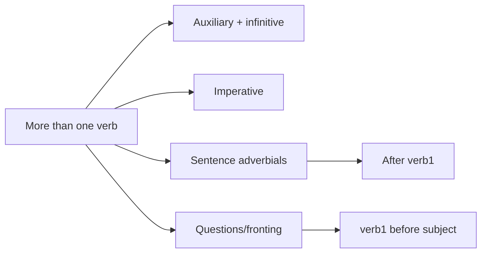

# 06 Commands and Clauses With More Than One Verb

## 1. Extracted Chapter Text

> [!info] Source text
> Extracted from book pages 35-42. Page markers are retained so the text can be checked against the PDF.

### Page 35

Commands and clauses with more
than one verb
Two or more verbs in succession
In English there are certain verbs that can be placed directly in front of
another verb, so that you get a succession of verbs, like this:
VERB, INFINITIVE
= v e r b 2
John can play the piano.
Peter could sing.
Mary must dance.
The first verb in these combinations is in the present or past. The second
verb is in the form called the infinitive. Swedish has similar combinations of
verbs: the first verb is, as in English, in the present or past and the second
verb is in the infinitive. In Swedish the infinitive usually ends in a:
X V
SUBJECT VERB! INFINITIVE
= v e r b 2
Jan kan spela piano.
Jan can play the piano.
Per kunde sjunga.
Per could sing.
Maria måste dansa.
Maria must dance.
Vi borde arbeta.
We should work.
Du får röka på balkongen.
You may smoke on the balcony.
Making the infinitive from the present
In a dictionary you usually find the verbs given in the infinitive form. When
you are just beginning to learn Swedish, however, you usually use the
present form. So it is useful to be able to work out the infinitive form of a
verb if you only know the present form. As you saw in 2.1, most verbs end in
the present in a r or er:

---

### Page 36

ar verbs
If the verb ends in a r in the present, take away the r:
PRESENT Take away r INFINITIVE
öppnar öppna/ ------------ *■ öppna open
arbetar arbeta/ ------------ arbeta work
regnar regna/ “ regna rain
In the past ar verbs end in ade. If you meet this form, you can make the
infinitive by taking away de: öppnade—*■ ö p p n a ^ —> öppna.
er verbs
If the verb ends in er in the present, first take away er and then add a:
PRESEN T Take away er Add a INFINITIVE
kommer komm^/ ------ ► kom m +a -----► komma come
sover sov^/ ------ ► sov+a ----- *-sova sleep
köper k ö p # -------- ► köp+ a ----- ►köpa buy
The er verbs have various past forms, which will be presented in 9.3, 9.7 and
9.8.
Some common auxiliary verbs
There are a number of verbs which are used only together with another verb.
They are called auxiliary verbs (hjälpverb). The other verbs are called main
verbs (huvudverb). An auxiliary verb always comes before a main verb.
In the table below you will find some of the most important auxiliary
verbs in Swedish. In the headings in bold print the infinitive is given first;
then, in brackets, come the present and past forms. These verbs are very
common, so it pays to learn them as quickly as possible.
kunna (kan, kunde) ‘be able’ (‘can’, ‘could’)
Vi kan komma till er på söndag. We can come to your house
on Sunday.
Vi kan tala engelska. We can speak English.
Hon kan spela tennis. She can play tennis.
Hon kunde inte spela igår. She could not play yesterday.
vi^a (vill, ville) ‘want to ’ (‘want to ’, ‘wanted to ’)
Karin vill titta på TV. Karin wants to watch TV.
Men Olle vill sova. But Olle wants to sleep.
Sten ville stanna hemma. Sten wanted to stay at home.
Note that the Swedish word vill does not mean ‘will’ in English, but corre­
sponds to ‘want to’, or sometimes ‘would like to ’. Note also that where
English uses ‘want’ followed by a noun as the object, the Swedish verb vilja
is followed by ha + the object:

---

### Page 37

Han vill ha kaffe. He wants coffee.
Han ville ha grädde till kaffet. He wanted cream with his coffee.
få (får, fick) ‘be allowed to ’; ‘have to’ (‘may’, ‘can’, ‘could’)
Du får röka, om du vill. You may (can) smoke if you want to.
Hon får inte komma ikväll. She can’t (mustn’t, isn’t allowed
to) come this evening.
Vi fick träffa hans fru. We were allowed to meet his wife.
or We got to meet his wife.
Hon fick vänta en timme. She had to wait an hour.
Note that få used as a main verb, with a noun as the object, means ‘get’,
‘receive’:
Hon fick en blomma. She got (received, was given) a flower.
De får alltid en present. They always get a present.
- (måste, måste) - , ‘have to ’ (‘must’, ‘have to’, ‘had to ’). This verb does not
have an infinitive either in Swedish or in English, and has the same form in
the present as in the past.
Du måste gå hem nu. You must go home now.
Olle måste sälja bilen. Olle must (had to) sell his car.
Jag måste arbeta hela I had to work the whole evening
kvällen igår. yesterday.
Men jag måste inte arbeta But I do not have to work every
varje kväll. evening.
Note that English ‘must not’ corresponds to Swedish får inte:
Du får inte röka här. You must not smoke here.
skola (ska, skulle) - , ‘have to ’ (‘shall’; ‘will’; ‘must’, ‘have to ’; ‘was/were
going to’; ‘should’; ‘would’). With future meaning, see 9.2, ska = ‘is/are
going to ’. In written language the form skall is often used instead of ska.
Du ska inte göra så. You must not (should not) do that.
Man ska alltid fråga honom You always have to ask him twice,
två gånger.
Vi skulle ha gjort det igår. We should have done it yesterday.
De ska köpa ett hus på landet. They are going to buy a house
in the country.
Vi skulle hjälpa dig. We were going to help you.
När ska vi komma? When shall we come?
Note that ska (skall) does not normally correspond to ‘shall’ in English.
böra (bör, borde) - (‘should’, ‘ought to’)
Man bör inte dricka mer än One should not drink more than
sex koppar kaffe om dagen. six cups of coffee a day.
Du borde köpa en ny väska. You ought to buy a new case.
De borde ha gjort det för They should have (ought to have)
länge sedan. done it long ago.

---

### Page 38

bruka (brukar, brukade) - (-, used to). The English auxiliary has only one
form, ‘used to ’, in the past. Bruka, brukar correspond to usually + the main
verb.
Jag brukar dricka kaffee I usually have coffee
efter lunch. after lunch.
Josefin brukar skriva dagbok Josefin usually writes her diary
varje dag. every day.
Vi brukade spela kort på We used to play cards on
lördagskvällarna. Saturday evenings.
behöva (behöver, behövde) ‘need to ’ (‘need to ’, ‘needed to ’)
Du behöver bara stanna två dagar. You only need to stay two days.
Han behövde inte vänta länge. He did not need to wait long.
Note that, just as in English, the verb behöva ‘need’ can also be followed by
a noun as the object.
Jag behöver hjälp. I need help.
Commands. The imperative
If you want to tell someone to do something, you use a form of the verb
called the imperative (imperativ)\
Come here.
Sit down.
In Swedish there is a special imperative form of the verb:
Kom hit! Come here.
Sätt dig! Sit down.
If you know the present form of an ar verb or an er verb, you can make the
imperative from it.
a r verbs
The a r verbs have the same form in the imperative as in the infinitive. So you
can make the imperative by taking away the r:
PRESEN T Take away r IM PERATIVE = INFINITIVE
öppnar öppna/ — -----► Öppna! open
lyssnar lyssna/ -----►Lyssna! listen
väntar vänta/ -----" Vänta! wait

---

### Page 39

er verbs
The er verbs do not have the same form in the imperative as in the infinitive.
You make the imperative by taking er away from the present:
PRESENT Take away er IM PERATIVE
skriver skriv# ---------► Skriv! write
känner k ä n n # -►Känn! feel
ringer ring # -► Ring! ring
läser lä s# -► Läs! read
Unfortunately you cannot make the imperative if you only know the
infinitive of a verb, since both ar verbs and er verbs end in a. You cannot see
from the infinitive which sort of verb it is. (But if you do know that the verb
is an er verb, you can make the imperative by taking away the a. If it is an ar
verb, you leave the a in the imperative.)
6.5 Commands, requests, and politeness phrases
If you want to be polite in English, you often use the word ‘please’ when you
ask or tell someone to do something. Similarly in Swedish you can add the
phrase är du snäll at the end of the sentence, or var snäll och at the
beginning of the sentence:
Köp en kvällstidning, är du snail. Buy an evening paper, please.
Stäng dörren, ä r du snäll. Please close the door.
Var snäll och hämta en kudde. Fetch a cushion, please.
Snäll is an adjective which literally means ‘kind’, ‘nice’. If you ask several
people to do something, you must use the plural form snälla (see 11.5).
Stäng dörren, är ni snälla. Close the door, please.
Var snälla och stäng dörren. Please close the door.
Again, just as in English, it is common in Swedish not to use an imperative
but to ask if someone can or could do something for you. The following
questions do not expect an answer; they expect that the person you ask will
do what is asked of him or her:
Kan du öppna fönstret? Can you open the window?
Kan du räcka mig saxen? Can you pass me the scissors?
Kan Ni stänga ytterdörren? Could you close the front door?
6.6 Word order in clauses with more than one verb
The tables for word order which we have already looked at can be expanded
to make room for a sequence of two or more verbs. The first verb in the
table is marked with a 1: V ER B ^ If there are any more verbs in the clause
they are placed under VERB:

---

### Page 40

/ V
SUBJECT VERB! VERB OBJECT A D V ERBIA L
Ola behöver låna pengar.
Ola needs to borrow money.
Jag måste gå till posten snart
I must go to the post office soon.
Det börjar regna nu.
It is beginning to rain now.
Hon måste sluta röka i december.
She must stop smoking in December.
Vi hörde ett flygplan.
We heard a plane.
If the clause only has one verb, as in the last example, it is, of course, placed
under V ERB,.
6.7 Sentence adverbials
There is a special group of adverbials that are placed in a different position in
the clause from the other adverbials. They are called sentence adverbials
(satsadverbial) . Actually inte ‘not’ (see 4.1) belongs to this group of adver­
bials. Others are alltid ‘always’, ofta ‘often’, ibland ‘sometimes’, aldrig
‘never’, säkert ‘certainly’, nog ‘probably’, kanske ‘perhaps’, tyvärr ‘unfortu­
nately’, lyckligtvis ‘fortunately’, sällan ‘seldom’.
These sentence adverbials are placed directly after VERBi:
/ V SENTENCE
SUBJECT VERBj A D V ERBIA L VERB OBJECT A D V ERBIA L
Vi vill inte dricka mjölk till maten.
We do not want to drink milk with our food.
Du måste alltid skriva postnummer på alla brev.
You must always write the postal code on all letters.
Det brukar aldrig snöa i augusti.
It very rarely snows in August.
Alla behöver inte sova åtta timmar.
Not everybody needs to sleep eight hours.
Olle reser sällan utomlands.
Olle seldom travels abroad.
Vi träffade ofta Per i Stockholm.
We often met Per in Stockholm.

---

### Page 41

As we saw when we dealt with clauses containing only one verb, the verb
comes before the subject in yes/no questions (see 4.2), in question-word
questions (4.3) and with fronting (4.6). In clauses with more than one verb it
is VERBj that is placed before the subject. The next few sections deal with
the word order in this kind of clause. To make it easier for you to see the
pattern we will not specify the parts of the sentence that follow the sentence
adverbial. They are not affected, and follow the same word order as in the
table above.
6.8 Yes/no questions with more than one verb
When you make a question that can be answered ‘Yes’ or ‘No’ (a yes/no
question, 4.2), V ERB, is placed at the beginning of the sentence and is
followed directly by the subject:
SENTENCE
VERB! SUBJECT ADV ERBIA L
Vill ni inte dricka mjölk till maten?
D on’t you want to drink milk with your food?
Kan du börja jobba på måndag?
Can you start work on Monday?
Måste flickan komma tillbaka imorgon?
Does the girl have to come back tomorrow?
Brukar de stanna i Sverige på sommaren?
Do they usually stay in Sweden in the summer?
Känner du Sven?
Do you know Sven?
Regnar det ofta på sommaren?
Does it often rain in the summer?
In short answers (4.7) the auxiliary verb is repeated. It cannot be replaced by
gora.
Kan du simma? Can you swim?
- Ja, det kan jag. - Yes, I can.
- Nej, det kan jag inte. - No, I can’t.
Vill hon spela? Does she want to play?
- Ja, det vill hon. - Yes, she does.
- Nej, det vill hon inte. - No, she doesn’t.

---

### Page 42

6.9 Question-word questions and fronting with more
than one verb
The rules for question-word questions and for fronting can be combined in
one rule. The table showing the word order is then as follows:
X or
QUESTIO N SENTENCE
W ORD VERB, SUBJECT A D V ERBIA L
Imorgon måste du komma i tid.
Tomorrow you must be on time.
H är får du inte röka.
You m ustn’t smoke here.
Förr ville Sten alltid titta på TV hela kvällen
Sten always used to want to watch TV all evening
Vad vill ni göra imorgon?
What do you want to do tomorrow?
H ur dags får jag ringa?
W hat time can I phone?
Vem kan jag fråga?
Who can I ask?
Vem kan inte simma?
Who can’t swim?
Vad hände på festen i fredags?
W hat happened at the party on Friday?
You can only leave the subject position empty when the question word is the
subject, as in the last two questions.

## 2. Organized Content

### 6 Commands And Clauses With More Than One Verb

#### Section Navigation

| Section | Topic | Main Point |
|---|---|---|
| 06.01 Two Or More Verbs In Succession|6.1 Two or more verbs in succession | Verb chains | The first verb is finite; the second is infinitive. |
| 06.02 Making The Infinitive From The Present|6.2 Making the infinitive from the present | Infinitive formation | `-ar` and `-er` verbs form infinitives differently. |
| 06.03 Some Common Auxiliary Verbs|6.3 Some common auxiliary verbs | Auxiliaries | Auxiliary verbs come before main verbs. |
| 06.04 Commands The Imperative|6.4 Commands. The imperative | Imperative | Commands use a special verb form. |
| 06.05 Commands Requests And Politeness Phrases|6.5 Commands, requests and politeness phrases | Politeness | `är du snäll` and `var snäll och` soften commands. |
| 06.06 Word Order In Clauses With More Than One Verb|6.6 Word order in clauses with more than one verb | Word order | Extra verbs are placed after the first verb. |
| 06.07 Sentence Adverbials|6.7 Sentence adverbials | Sentence adverbials | Words like `inte`, `alltid`, `aldrig` follow the first verb. |
| no questions with more than one verb | Questions | The first verb moves before the subject. |
| 06.09 Question Word Questions And Fronting With More Than One Verb|6.9 Question-word questions and fronting with more than one verb | Fronting and questions | `X/question word + verb1 + subject`. |

#### Chapter Map



### 6.1 Two Or More Verbs In Succession

#### Core Pattern

```text
Subject + verb1 + infinitive
```

| Subject | Verb 1 | Infinitive | English |
|---|---|---|---|
| Jan | kan | spela piano. | Jan can play the piano. |
| Per | kunde | sjunga. | Per could sing. |
| Maria | måste | dansa. | Maria must dance. |
| Vi | borde | arbeta. | We should work. |
| Du | får | röka på balkongen. | You may smoke on the balcony. |

#### Key Point

The first verb carries tense. The second verb is the infinitive, which in Swedish usually ends in `-a`.

### 6.2 Making The Infinitive From The Present

#### Ar Verbs

If a present-tense verb ends in `-ar`, remove final `-r`.

| Present | Operation | Infinitive | English |
|---|---|---|---|
| öppnar | remove `r` | öppna | open |
| arbetar | remove `r` | arbeta | work |
| regnar | remove `r` | regna | rain |

If you meet the past form of an `-ar` verb, remove `-de`:

```text
öppnade -> öppna
```

#### Er Verbs

If a present-tense verb ends in `-er`, remove `-er` and add `-a`.

| Present | Stem | Add | Infinitive | English |
|---|---|---|---|---|
| kommer | komm | a | komma | come |
| sover | sov | a | sova | sleep |
| köper | köp | a | köpa | buy |

### 6.3 Some Common Auxiliary Verbs

#### Auxiliary Verb Pattern

```text
auxiliary verb + main verb in the infinitive
```

#### Common Auxiliary Verbs

| Infinitive | Present | Past | Core Meaning |
|---|---|---|---|
| kunna | kan | kunde | be able to, can, could |
| vilja | vill | ville | want to |
| få | får | fick | be allowed to, may; sometimes have to |
| - | måste | måste | must, have to |
| skola | ska/skall | skulle | shall, will, should, be going to |
| böra | bör | borde | should, ought to |
| bruka | brukar | brukade | usually, used to |
| behöva | behöver | behövde | need to |

#### Examples

| Swedish | English |
|---|---|
| Vi kan komma till er på söndag. | We can come to your house on Sunday. |
| Karin vill titta på TV. | Karin wants to watch TV. |
| Du får röka, om du vill. | You may smoke if you want to. |
| Du måste gå hem nu. | You must go home now. |
| De ska köpa ett hus på landet. | They are going to buy a house in the country. |
| Du borde köpa en ny väska. | You ought to buy a new case. |
| Jag brukar dricka kaffe efter lunch. | I usually have coffee after lunch. |
| Du behöver bara stanna två dagar. | You only need to stay two days. |

#### Important Notes

| Swedish Form | Note |
|---|---|
| `vill` | Does not mean English `will`; it means `want to` or sometimes `would like to`. |
| `vill ha` | Used when English `want` is followed by a noun: `Han vill ha kaffe.` |
| `får inte` | Corresponds to English `must not`: `Du får inte röka här.` |
| `ska/skall` | Often marks future meaning, but does not normally correspond directly to English `shall`. |
| `behöva` | Can be followed by a verb or by a noun object. |

### 6.4 Commands. The Imperative

#### Basic Examples

| Swedish | English |
|---|---|
| Kom hit! | Come here! |
| Sätt dig! | Sit down! |

#### Ar Verbs

For `-ar` verbs, the imperative is the same as the infinitive. Remove final `-r` from the present.

| Present | Imperative | English |
|---|---|---|
| öppnar | Öppna! | open |
| lyssnar | Lyssna! | listen |
| väntar | Vänta! | wait |

#### Er Verbs

For `-er` verbs, remove `-er` from the present.

| Present | Imperative | English |
|---|---|---|
| skriver | Skriv! | write |
| känner | Känn! | feel |
| ringer | Ring! | ring |
| läser | Läs! | read |

### 6.5 Commands, Requests And Politeness Phrases

#### Politeness Phrases

| Swedish | English |
|---|---|
| Köp en kvällstidning, är du snäll. | Buy an evening paper, please. |
| Stäng dörren, är du snäll. | Please close the door. |
| Var snäll och hämta en kudde. | Fetch a cushion, please. |

#### Singular And Plural

`snäll` literally means kind or nice. With several people, use plural `snälla`.

| Swedish | English |
|---|---|
| Stäng dörren, är ni snälla. | Close the door, please. |
| Var snälla och stäng dörren. | Please close the door. |

#### Requests With Questions

Like English, Swedish often avoids a direct imperative by asking whether someone can do something.

| Swedish | English |
|---|---|
| Kan du öppna fönstret? | Can you open the window? |
| Kan du räcka mig saxen? | Can you pass me the scissors? |
| Kan Ni stänga ytterdörren? | Could you close the front door? |

### 6.6 Word Order In Clauses With More Than One Verb

#### Word Order Table

| Subject | Verb 1 | Verb | Object | Adverbial |
|---|---|---|---|---|
| Ola | behöver | låna | pengar. |  |
| Jag | måste | gå |  | till posten snart. |
| Det | börjar | regna |  | nu. |
| Hon | måste | sluta röka |  | i december. |
| Vi | hörde |  | ett flygplan. |  |

If the clause only has one verb, it is placed under `verb1`.

### 6.7 Sentence Adverbials

#### Common Sentence Adverbials

| Swedish | English |
|---|---|
| inte | not |
| alltid | always |
| ofta | often |
| ibland | sometimes |
| aldrig | never |
| säkert | certainly |
| nog | probably |
| kanske | perhaps |
| tyvärr | unfortunately |
| lyckligtvis | fortunately |
| sällan | seldom |

#### Position

Sentence adverbials are placed directly after `verb1`.

| Subject | Verb 1 | Sentence Adverbial | Verb | Object / Adverbial |
|---|---|---|---|---|
| Vi | vill | inte | dricka | mjölk till maten. |
| Du | måste | alltid | skriva | postnummer på alla brev. |
| Det | brukar | aldrig | snöa | i augusti. |
| Alla | behöver | inte | sova | åtta timmar. |
| Olle | reser | sällan |  | utomlands. |
| Vi | träffade | ofta |  | Per i Stockholm. |

### 6.8 Yes/No Questions With More Than One Verb

#### Pattern

```text
Verb1 + subject + sentence adverbial + remaining verb(s)
```

| Verb 1 | Subject | Sentence Adverbial | Rest | English |
|---|---|---|---|---|
| Vill | ni | inte | dricka mjölk till maten? | Don't you want to drink milk with your food? |
| Kan | du |  | börja jobba på måndag? | Can you start work on Monday? |
| Måste | flickan |  | komma tillbaka imorgon? | Does the girl have to come back tomorrow? |
| Brukar | de |  | stanna i Sverige på sommaren? | Do they usually stay in Sweden in the summer? |
| Känner | du |  | Sven? | Do you know Sven? |
| Regnar | det | ofta | på sommaren? | Does it often rain in the summer? |

#### Short Answers

In short answers, the auxiliary verb is repeated; it is not replaced by `göra`.

| Question | Yes | No |
|---|---|---|
| Kan du simma? | Ja, det kan jag. | Nej, det kan jag inte. |
| Vill hon spela? | Ja, det vill hon. | Nej, det vill hon inte. |

### 6.9 Question-Word Questions And Fronting With More Than One Verb

#### Pattern

```text
X / question word + verb1 + subject + sentence adverbial + rest
```

| X / Question Word | Verb 1 | Subject | Sentence Adverbial | Rest |
|---|---|---|---|---|
| Imorgon | måste | du |  | komma i tid. |
| Här | får | du | inte | röka. |
| Förr | ville | Sten | alltid | titta på TV hela kvällen. |
| Vad | vill | ni |  | göra imorgon? |
| Hur dags | får | jag |  | ringa? |
| Vem | kan | jag |  | fråga? |
| Vem | kan |  | inte | simma? |
| Vad | hände |  |  | på festen i fredags? |

#### Subject Position

The subject position can be empty only when the question word itself is the subject, as in `Vem kan inte simma?` and `Vad hände...?`.

## 3. Summary

### 6 Commands And Clauses With More Than One Verb

##### 中文总结

第 6 章的核心是多动词结构。瑞典语中第一个动词是有限动词，后面的动词通常是不定式。句子副词如 `inte`、`alltid`、`aldrig` 放在第一个动词后。疑问句和前置结构中移动的是第一个动词。

##### 学习建议

- 用 `verb1 + infinitive` 的方式标记多动词句。
- 单独背常见 auxiliary verbs：`kan`, `vill`, `får`, `måste`, `ska`, `bör`, `brukar`, `behöver`。
- 区分命令式、请求和一般疑问句。

### 6.1 Two Or More Verbs In Succession

##### 中文总结

多动词结构中，第一个动词表示时态或情态，第二个动词通常是不定式。例如 `kan spela`, `måste dansa`, `borde arbeta`。

##### 检查点

- 是否能识别 `verb1 + infinitive`？
- 是否知道第二个动词通常以 `-a` 结尾？
- 是否能造句：`Jag kan ...`？

### 6.2 Making The Infinitive From The Present

##### 中文总结

从现在时推不定式：`-ar` 动词去掉 `r`；`-er` 动词去掉 `er` 后加 `a`。例如 `öppnar -> öppna`, `kommer -> komma`。

##### 检查点

- 是否能从 `arbetar` 得到 `arbeta`？
- 是否能从 `sover` 得到 `sova`？
- 是否能区分 `-ar` 和 `-er` 动词？

### 6.3 Some Common Auxiliary Verbs

##### 中文总结

本节要背常见助动词。助动词放在主动词前，主动词通常是不定式。重点注意 `vill` 不是 will，而是 want to；`får inte` 表示 must not；`ska` 常表示将来或应当。

##### 检查点

- 是否能背出 `kan/kunde`, `vill/ville`, `får/fick`, `måste`, `ska/skulle`？
- 是否能解释 `vill ha`？
- 是否知道短答中助动词要重复？

### 6.4 Commands. The Imperative

##### 中文总结

命令式用于发出命令。`-ar` 动词命令式与不定式相同：`öppnar -> Öppna!`；`-er` 动词去掉 `er`：`skriver -> Skriv!`。

##### 检查点

- 是否能从现在时构造命令式？
- 是否能区分 `Öppna!` 和 `Skriv!` 的形成方式？
- 是否知道只看不定式时不一定能判断命令式？

### 6.5 Commands, Requests And Politeness Phrases

##### 中文总结

瑞典语礼貌请求可以用 `är du snäll` 或 `var snäll och`。对多人使用 `snälla`。也可以用 `Kan du...?` 形式提出请求。

##### 检查点

- 是否能用 `är du snäll` 改写命令？
- 是否知道复数用 `snälla`？
- 是否能用 `Kan du...?` 提出礼貌请求？

### 6.6 Word Order In Clauses With More Than One Verb

##### 中文总结

多动词句中第一个动词放在 `verb1`，后续动词放在后面的 verb 位置。只有一个动词时，它就是 `verb1`。

##### 检查点

- 是否能标出 `Jag måste gå` 中的 `verb1` 和后续动词？
- 是否知道 `Det börjar regna nu` 的结构？
- 是否能解释单动词句如何放入同一表格？

### 6.7 Sentence Adverbials

##### 中文总结

句子副词 `satsadverbial` 放在 `verb1` 后。`inte` 也是句子副词。常见词包括 `alltid`, `ofta`, `aldrig`, `kanske`, `tyvärr`, `sällan`。

##### 检查点

- 是否能说明 `inte` 为什么和普通状语不同？
- 是否能把 `alltid` 放在正确位置？
- 是否能分析 `Du måste alltid skriva...`？

### 6.8 Yes/No Questions With More Than One Verb

##### 中文总结

多动词一般疑问句移动的是 `verb1`：`Kan du simma?`。短答中重复助动词，不能用 `göra` 替代。

##### 检查点

- 是否能把 `Du kan simma` 改成 `Kan du simma?`？
- 是否能回答 `Ja, det kan jag`？
- 是否知道短答中助动词要重复？

### 6.9 Question-Word Questions And Fronting With More Than One Verb

##### 中文总结

疑问词问句和前置结构可用同一规则：开头成分后面接 `verb1`，再接主语。只有当疑问词本身是主语时，主语位置才可以空着。

##### 检查点

- 是否能分析 `Vad vill ni göra imorgon?`？
- 是否知道 `Här får du inte röka` 的词序？
- 是否能解释什么时候主语位置为空？
