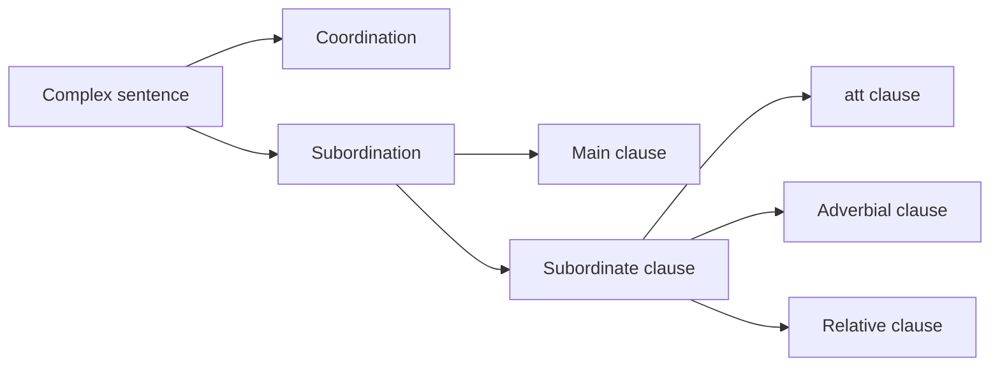

# 07 Complex Sentences

## 1. Extracted Chapter Text

> [!info] Source text
> Extracted from book pages 43-48. Page markers are retained so the text can be checked against the PDF.

### Page 43

Complex sentences
As we saw in 1.3, a sentence can consist of one or more clauses. A sentence
that consists of only one clause is called a simple sentence (enkel mening). A
sentence that consists of two ore more clauses is called a complex sentence
(sammansatt mening). The first two sentences below consist of only one
clause; they are simple sentences, The remaining three sentences are
complex sentences.
Per sjunger. Per sings.
Lotta spelar dragspel. Lotta plays the accordion.
Per sjunger och Lotta spelar Per sings and Lotta plays the
dragspel. accordion.
De säger, att Per sjunger. They say that Per sings.
De säger, att Per sjunger och They say that Per sings and that
att Lotta spelar dragspel. Lotta plays the accordion.
In previous chapters we have seen how simple sentences consisting of only
one clause are made. In this chapter we shall show how complex sentences
are made by joining simple sentences together in various ways.
Coordination and subordination
Two clauses can be joined together by och ‘and’. This is called coordination
(samordning):
Per sjunger. I I Lotta spelar dragspel.
CO O R D IN A T IO N
Per sjunger och Lotta spelar dragspel.
The clauses that are coordinated by och are equal. One clause can also be
included in another clause, so that it becomes a part of the other clause. This
is called subordination (underordning). In the following example the clause
Per brukar äta vitlök (Per usually eats garlic1 is subordinated by being
introduced by att ‘that’:
Per brukar äta vitlök. Eva säger det.
Per usually eats garlic. Eva says so.
SUB O R D IN A T IO N
Eva säger, att Per brukar äta vitlök.
Eva says that Per usually eats garlic.

---

### Page 44

The clause introduced by att acts as the object of the verb säger ‘says’ in the
same way as det does in the first example. Compare the examples in the
following table showing word order:
SUBJECT VERB OBJECT
Eva säger det.
Eva säger, att Per brukar äta vitlök.
Main clause and subordinate clause
A distinction is also made between main clauses and subordinate clauses. A
clause that is part of another clause is called a subordinate clause or a sub­
clause (bisats). A subordinate clause can never make a sentence by itself. A
clause which is independent and is not part of another clause is called a main
clause (huvudsats). A clause that makes a sentence by itself is always a main
clause:
MAIN CLAUSE MAIN CLAUSE
Per sjunger. Per sings.
A sentence must always contain at least one main clause. If you coordinate
two main clauses, they are still main clauses:
MAIN CLAUSE MAIN CLAUSE
Per sjunger och Lotta spelar dragspel.
Per sings and Lotta plays the accordion.
If you use subordination, one clause is changed into a subordinate clause.
The clause that the subordinate clause is part of is the main clause. The
example given in 7.1 is built up in the following way:
MAIN CLAUSE
Eva säger, att Per brukar äta vitlök.
SUB-CLAUSE
If you coordinate two subordinate clauses with och ‘and’, they remain sub­
clauses:
MAIN CLAUSE
Eva säger, att Per sjunger och att Lotta spelar dragspel.
SUB-CLAUSE SUB-CLAUSE
There are several different kinds of subordinate clauses. The most important
of them will be described in the following sections.

---

### Page 45

7.3 Att clauses
Subordinate clauses that begin with att are called att clauses (att-bisatser).
They usually act as the object of verbs like säga ‘say’, veta ‘know’, tro
‘think’, se ‘see’ and höra ‘hear’:
Mannen sa, att han var trött. The man said that he was tired.
Jag tror, att Elsa kommer hit I think that Elsa will come here
ikväll. this evening.
Alla vet, att chefen kom för sent Everyone knows that the boss
imorse. was late this morning.
Vi såg nog, att du gäspade. We saw that you yawned alright.
Jag hör, att någon startar I can hear that someone is
en bil. starting a car.
As in English, you can leave out the word att ‘that’, but not always. You can
do so, for example, in the first two sentences above:
Mannen sa han var trött. The man said he was tired.
Jag tror Elsa kommer hit I think Elsa will come here
ikväll. this evening.
But it is never wrong to include att, so it is simplest to do so if you are not
sure which is best.
In Swedish you can put a comma (kommatecken) (,) before an att clause,
provided that att is not omitted. However, the comma is not obligatory.
Usually the comma is omitted if the att clause is relatively short, as in the
examples above. We have included the comma, however, to show where it
may be placed.
7.4 Adverbial clauses
Subordinate clauses can also act as adverbials. These clauses are called
adverbial clauses (adverbialsbisatser). It is easy to recognize adverbial clauses
by their opening word. The commonest words that open adverbial clauses
are:
när ‘when’
Mamman vaknade när barnet The mother woke up when the
började gråta. child began to cry.
innan ‘before’
Karin gör läxorna innan hon Karin does her homework
äter middag. before she has supper.
medan ‘while’
Du kan läsa tidningen medan You can read the paper while
jag duschar. I have a shower.

---

### Page 46

om ‘if
Jag går hem om Lisa I’ll go home if Lisa
kommer hit. comes here.
därför att ‘because’
Olle grät, därför att Ville hade Olle cried because Ville had
retat honom. teased him.
eftersom ‘since’, ‘as’
Vi badade inte, eftersom vattnet We didn’t bathe as (since)
var förorenat. the water was polluted.
fastän ‘although’, ‘though’
Olle somnade i soffan, fastän Olle fell asleep on the sofa
familjen tittade på TV. although the family was
watching TV.
trots att ‘although’, ‘in spite of the fact that’
Vi gav oss iväg, trots att det We set off although (in spite of
regnade. the fact that) it was raining.
Adverbial clauses can be placed in a word-order table. They come in the
same place as other adverbials:
/ V
SUBJECT VERB OBJECT A D V ERBIA L
Jag träffade Lisa imorse.
I met Lisa this morning.
Jag träffade Lisa när jag handlade mat.
I met Lisa when I was doing the food shopping.
Jag betalar bensinen om du skjutsar mig hem.
I’ll pay for the petrol if you give me a lift home.
Olle somnade i soffan, fastän familjen tittade på TV.
Olle fell asleep on the sofa although the family was watching TV.
Adverbial clauses can be placed first in the sentence just like other adverbi­
als (see 4.6). Note that the subject must come after the verb in the main
clause, in exactly the same way as when an ordinary adverbial is placed at the
front of the sentence:
X VERB SUBJECT OBJECT A D V ER B IA L
Imorse träffade jag Lisa.
This morning, I met Lisa.
När jag handlade m at, träffade jag Lisa.
When I was doing the food shopping, I met Lisa.
Om du skjutsar mig hem, betalar jag bensinen.
If you give me a lift home, I'll pay for the petrol.
Fastän familjen tittade på TV, somnade Olle i soffan.
Although the family was watching TV, Olle fell asleep on the sofa.

---

### Page 47

A comma can be placed both before and after an adverbial clause in
Swedish, if it is necessary for the sake of clarity. The comma is often omitted
in these cases, too. We have included the comma in the examples above
merely to show where it may be placed. The comma is not obligatory.
Note that the subject can never be left out after the subordinators listed
above:
Eva gick till jobbet, trots Eva went to work in spite
att hon var förkyld. of having a cold.
När jag gick längs gatan, Walking along the street
träffade jag min vän Per. I met my friend Per.
7.5 Word order in subordinate clauses
The word order in a subordinate clause is in certain respects different from
the word order in a main clause. This is particularly true of the position of
sentence adverbials (compare 6.7). Sentence adverbials are always placed
before the verb in a subordinate clause. Compare the following examples in
which the same clause appears first as a main clause and then as a subordi­
nate clause:
Sten vill inte sova. Sten doesn’t want to sleep.
Olle säger, att Sten inte Olle says that Sten doesn’t
vill sova. want to sleep.
Per kommer alltid för sent. Per is always late.
Vi väntar inte på Per, eftersom We won’t wait for Per as he is
han alltid kommer för sent. always late.
De slutar inte sjunga. They don’t stop singing.
Jag blir arg, om de inte I’ll get angry if they don’t
slutar sjunga. stop singing.
In English sentences the sentence adverbials have the same position in both
main and subordinate clauses, so it is important to remember that the word
order is not the same in Swedish: sentence adverbials in subordinate clauses
always come before the verb in Swedish.
Also, the subject always comes before the verb in a subordinate clause.
Here it is not possible to put any other part of a sentence before the subject.
However, as we have seen, subordinate clauses usually begin with an open­
ing word called a subordinator (bisatsinledare). The following table shows
how the word order in a subordinate clause differs from the word order in a
main clause:

---

### Page 48

SUB ORD- ^ ^ S E N T E N C E ^ . (the rest as in
INATOR SUBJECT AD V ERBIA L VERB, a main clause)
Olle säger, att Sten inte vill sova.
Olle says that Sten does not want to sleep.
Camilla säger, att hon kan spela tennis.
Camilla says that she can play tennis.
Ola säger, att han inte kan spela tennis.
Ola says that he cannot play tennis.
Jag vet, att de alltid reser till fjällen på vintern
I know that they always go up to the mountains in the winter.
Per tippar, trots att han aldrig vinner.
Per does the pools although he never wins.
Vi kommer, om vi inte måste jobba över.
We’ll come if we do not have to work overtime.
Alla gillar Eva, eftersom hon ofta skojar om allting.
Everybody likes Eva as she often jokes about everything.
7.6 Relative clauses
There is also a type of sub-clause that tells you more about a noun. This is
called a relative clause (relativbisats). Relative clauses in English are mostly
introduced by ‘who’, ‘which1 or ‘that’. In Swedish they are introduced by
som. This word never changes its form:
Sten har en syster, som bor Sten has a sister who lives
i Malmö. in Malmö.
Lasse känner en kvinna, som Lasse knows a woman who works
arbetar på DN. at DN.
Stig har en papegoja som talar. Stig has a parrot that talks.
Ann har två dockor, som Ann has two dolls which are
är sönder. broken.
Relative clauses are described in greater detail in 16.7.

## 2. Organized Content

### 7 Complex Sentences

#### Section Navigation

| Section | Topic | Main Point |
|---|---|---|
| 07.01 Coordination And Subordination|7.1 Coordination and subordination | Joining clauses | Clauses can be coordinated or subordinated. |
| 07.02 Main Clause And Subordinate Clause|7.2 Main clause and subordinate clause | Clause types | A sentence needs at least one main clause. |
| 07.03 Att Clauses|7.3 Att clauses | `att` clauses | `att` clauses often act as objects. |
| 07.04 Adverbial Clauses|7.4 Adverbial clauses | Adverbial subclauses | Subordinate clauses can act as adverbials. |
| 07.05 Word Order In Subordinate Clauses|7.5 Word order in subordinate clauses | Subordinate word order | Sentence adverbials precede the verb in subclauses. |
| 07.06 Relative Clauses|7.6 Relative clauses | Relative clauses | Swedish relative clauses use `som`. |

#### Chapter Map



### 7.1 Coordination And Subordination

#### Coordination

Two clauses can be joined by `och` ("and"). This is coordination (`samordning`).

| Clause 1 | Connector | Clause 2 | English |
|---|---|---|---|
| Per sjunger | och | Lotta spelar dragspel. | Per sings and Lotta plays the accordion. |

#### Subordination

One clause can be included inside another clause. This is subordination (`underordning`).

| Main Clause Frame | Subordinate Clause | English |
|---|---|---|
| Eva säger, | att Per brukar äta vitlök. | Eva says that Per usually eats garlic. |

The `att` clause acts as the object of `säger`, just as `det` could act as an object.

| Subject | Verb | Object |
|---|---|---|
| Eva | säger | det. |
| Eva | säger | att Per brukar äta vitlök. |

### 7.2 Main Clause And Subordinate Clause

#### Main Clause

| Clause | English |
|---|---|
| Per sjunger. | Per sings. |

A sentence must always contain at least one main clause.

#### Coordinated Main Clauses

If two main clauses are coordinated, they remain main clauses.

| Main Clause 1 | Connector | Main Clause 2 |
|---|---|---|
| Per sjunger | och | Lotta spelar dragspel. |

#### Subordinate Clause

In subordination, one clause becomes a subordinate clause (`bisats`).

| Main Clause | Subordinate Clause |
|---|---|
| Eva säger, | att Per brukar äta vitlök. |

Two subordinate clauses can also be coordinated with `och`.

| Main Clause | Subordinate Clause 1 | Connector | Subordinate Clause 2 |
|---|---|---|---|
| Eva säger, | att Per sjunger | och | att Lotta spelar dragspel. |

### 7.3 Att Clauses

#### Common Verb Contexts

| Verb Type | Swedish Example |
|---|---|
| säga | Mannen sa, att han var trött. |
| tro | Jag tror, att Elsa kommer hit ikväll. |
| veta | Alla vet, att chefen kom för sent imorse. |
| se | Vi såg nog, att du gäspade. |
| höra | Jag hör, att någon startar en bil. |

#### Omitting Att

As English can omit "that", Swedish can sometimes omit `att`.

| With `att` | Without `att` |
|---|---|
| Mannen sa, att han var trött. | Mannen sa han var trött. |
| Jag tror, att Elsa kommer hit ikväll. | Jag tror Elsa kommer hit ikväll. |

When unsure, including `att` is safe.

#### Comma

A comma may be placed before an `att` clause if `att` is present, but it is not obligatory. It is often omitted when the `att` clause is short.

### 7.4 Adverbial Clauses

#### Common Subordinators

| Swedish | English | Example Function |
|---|---|---|
| när | when | time |
| innan | before | time |
| medan | while | time |
| om | if | condition |
| därför att | because | reason |
| eftersom | since, as | reason |
| fastän | although, though | contrast |
| trots att | although, in spite of the fact that | contrast |

#### Examples

| Swedish | English |
|---|---|
| Mamman vaknade när barnet började gråta. | The mother woke up when the child began to cry. |
| Karin gör läxorna innan hon äter middag. | Karin does her homework before she has supper. |
| Du kan läsa tidningen medan jag duschar. | You can read the paper while I have a shower. |
| Jag går hem om Lisa kommer hit. | I will go home if Lisa comes here. |
| Vi badade inte, eftersom vattnet var förorenat. | We did not bathe since the water was polluted. |

#### Position

Adverbial clauses occupy the same position as other adverbials.

| Subject | Verb | Object | Adverbial Clause |
|---|---|---|---|
| Jag | träffade | Lisa | när jag handlade mat. |
| Jag | betalar | bensinen | om du skjutsar mig hem. |
| Olle | somnade |  | fastän familjen tittade på TV. |

#### Fronted Adverbial Clauses

Adverbial clauses can be placed first. The main clause then has verb before subject.

| Fronted Clause | Verb | Subject | Rest |
|---|---|---|---|
| När jag handlade mat, | träffade | jag | Lisa. |
| Om du skjutsar mig hem, | betalar | jag | bensinen. |
| Fastän familjen tittade på TV, | somnade | Olle | i soffan. |

### 7.5 Word Order In Subordinate Clauses

#### Main Clause Vs Subordinate Clause

| Main Clause | Subordinate Clause |
|---|---|
| Sten vill inte sova. | Olle säger, att Sten inte vill sova. |
| Per kommer alltid för sent. | Vi väntar inte på Per, eftersom han alltid kommer för sent. |
| De slutar inte sjunga. | Jag blir arg, om de inte slutar sjunga. |

#### Subordinate Clause Pattern

```text
subordinator + subject + sentence adverbial + verb1 + ...
```

| Subordinator | Subject | Sentence Adverbial | Verb 1 | Rest |
|---|---|---|---|---|
| att | Sten | inte | vill | sova. |
| att | hon |  | kan | spela tennis. |
| att | han | inte | kan | spela tennis. |
| att | de | alltid | reser | till fjällen på vintern. |
| trots att | han | aldrig | vinner. |  |
| om | vi | inte | måste | jobba över. |
| eftersom | hon | ofta | skojar | om allting. |

#### Key Contrast

In English, sentence adverbials often keep the same position in main and subordinate clauses. In Swedish, subordinate-clause word order is different.

### 7.6 Relative Clauses

#### Examples

| Swedish | English |
|---|---|
| Sten har en syster, som bor i Malmö. | Sten has a sister who lives in Malmö. |
| Lasse känner en kvinna, som arbetar på DN. | Lasse knows a woman who works at DN. |
| Stig har en papegoja som talar. | Stig has a parrot that talks. |
| Ann har två dockor, som är sönder. | Ann has two dolls which are broken. |

#### Key Point

`som` can correspond to English `who`, `which`, or `that`, but Swedish `som` itself does not change form.

More detail appears later in section 16.7.

## 3. Summary

### 7 Complex Sentences

##### 中文总结

第 7 章处理复合句。并列 `coordination` 是两个同等分句连接；从属 `subordination` 是一个分句嵌入另一个分句。瑞典语从句中的句子副词位置与主句不同，这是本章最重要的词序规则。

##### 学习建议

- 每个复合句先标出 main clause 和 subordinate clause。
- 看到 `att`, `när`, `om`, `eftersom`, `som` 等词时，优先判断是否引出从句。
- 从句中重点检查句子副词位置。

### 7.1 Coordination And Subordination

##### 中文总结

并列是同等分句相连，如 `Per sjunger och Lotta spelar dragspel`。从属是一个分句成为另一个分句的一部分，如 `Eva säger, att...`。

##### 检查点

- 是否能区分 coordination 和 subordination？
- 是否知道 `och` 常用于并列？
- 是否能说明 `att` 从句可作宾语？

### 7.2 Main Clause And Subordinate Clause

##### 中文总结

主句 `huvudsats` 可独立成句；从句 `bisats` 是另一个分句的一部分，不能独立成句。一个句子至少需要一个主句。

##### 检查点

- 是否能判断一个分句是否可独立成句？
- 是否能标出 `Eva säger, att...` 中的主句和从句？
- 是否知道从句也可以并列？

### 7.3 Att Clauses

##### 中文总结

`att` 从句常作动词宾语，对应英语 that-clause。`att` 有时可省略，但不确定时保留 `att` 最安全。逗号可用但不强制。

##### 检查点

- 是否能识别 `att-bisats`？
- 是否知道 `att` 从句常跟在 `säga`, `tro`, `veta` 等动词后？
- 是否知道逗号不是必须的？

### 7.4 Adverbial Clauses

##### 中文总结

状语从句由 `när`, `innan`, `medan`, `om`, `eftersom`, `fastän` 等词引出。它们可放在句末，也可前置；前置后主句仍需动词在主语前。

##### 检查点

- 是否能背出常见 adverbial clause 开头词？
- 是否能分析 `Om du..., betalar jag...`？
- 是否知道从属连词后不能省略主语？

### 7.5 Word Order In Subordinate Clauses

##### 中文总结

瑞典语从句中句子副词放在动词前：`att Sten inte vill sova`。这是与主句 `Sten vill inte sova` 的关键差异。

##### 检查点

- 是否能写出从句词序公式？
- 是否能比较 `vill inte` 和 `inte vill`？
- 是否能分析 `om vi inte måste jobba över`？

### 7.6 Relative Clauses

##### 中文总结

关系从句补充说明名词。瑞典语用 `som` 引导，`som` 不随先行词变化，可对应英语 who/which/that。

##### 检查点

- 是否能识别 `som` 引导的关系从句？
- 是否知道 `som` 不变形？
- 是否能造句：`Jag har en vän som...`？
