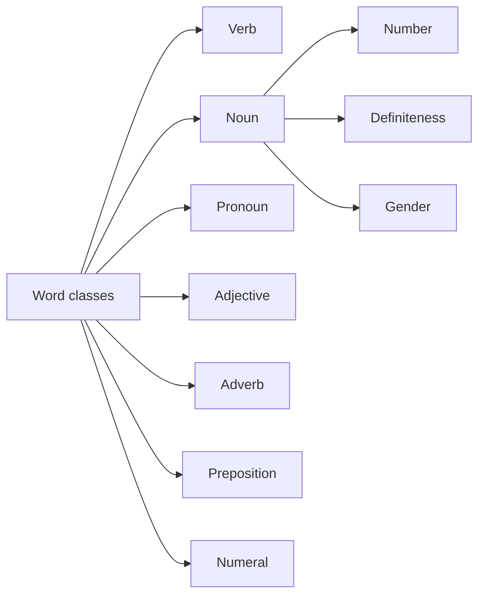

# 2 Word Classes

## Source Correspondence

This chapter introduces the main word classes used in Swedish grammar. It begins with the verb, then moves through nouns, number, definiteness, gender, personal pronouns, adjectives, adverbs, prepositions, and numerals. The chapter is designed as a grammatical toolkit: each word class has its own typical function and its own typical forms.

## Section Navigation

| Section | Topic | Main Point |
|---|---|---|
| [[02.01 The Verb and Its Forms\|2.1 The verb and its forms]] | Verbs | Swedish verbs mark tense but not continuous aspect. |
| [[02.02 The Noun and Its Forms\|2.2 The noun and its forms]] | Nouns | Nouns denote people, animals, things, materials, and ideas. |
| [[02.03 Number\|2.3 Number]] | Singular and plural | Swedish has several plural endings. |
| [[02.04 Definiteness\|2.4 Definiteness]] | Articles | The Swedish definite article is usually an ending. |
| [[02.05 Gender En Words and Ett Words\|2.5 Gender: en words and ett words]] | Gender | Nouns are learned as `en` words or `ett` words. |
| [[02.06 Personal Pronouns\|2.6 Personal pronouns]] | Pronouns | Pronouns show person and agree with noun gender for `it`. |
| [[02.07 Adjectives\|2.7 Adjectives]] | Adjectives | Adjectives describe qualities and can stand before nouns or after `är`. |
| [[02.08 Adverbs\|2.8 Adverbs]] | Adverbs | Adverbs qualify verbs or adjectives. |
| [[02.09 Prepositions\|2.9 Prepositions]] | Prepositions | Prepositions are best learned in phrases. |
| [[02.10 Numerals\|2.10 Numerals]] | Numbers | Cardinal and ordinal numbers form a separate word class. |

## Chapter Map

## Key Terms

| English | Swedish | Chinese |
|---|---|---|
| word class / part of speech | ordklass | 词类 |
| verb | verb | 动词 |
| tense | tempus | 时态 |
| present | presens | 现在时 |
| past / preterite | preteritum | 过去时 |
| infinitive | infinitiv | 不定式 |
| noun | substantiv | 名词 |
| number | numerus | 数 |
| singular | singular | 单数 |
| plural | plural | 复数 |
| definite article | bestämd artikel | 定冠词 |
| indefinite article | obestämd artikel | 不定冠词 |
| gender | genus | 性 |
| personal pronoun | personligt pronomen | 人称代词 |
| adjective | adjektiv | 形容词 |
| adverb | adverb | 副词 |
| preposition | preposition | 介词 |
| numeral | räkneord | 数词 |

## Study Notes / Summary

### 中文总结

第 2 章建立瑞典语基础词类框架。动词的重点是时态和词尾；名词的重点是数、定性和 `en/ett` 性别；代词、形容词、副词、介词和数词则为后续句法规则提供基本材料。

### 学习建议

- 新学名词时同时记 `en/ett` 和复数形式。
- 新学动词时先记现在时，再补过去时和不定式。
- 介词不要孤立记，优先记短语，如 `i Stockholm`, `på onsdag`。
