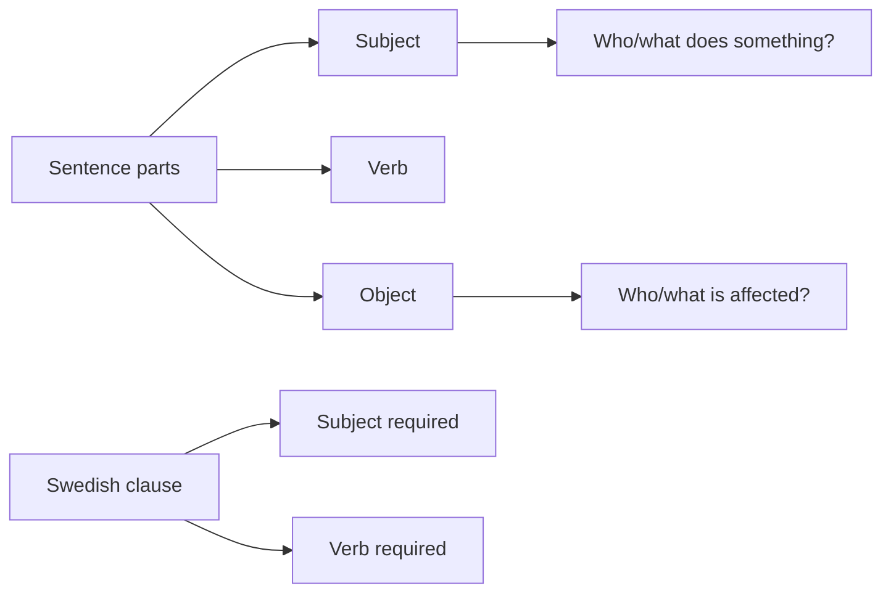

# 3 Subject, Verb And Object

## Source Correspondence

This chapter moves from word classes to parts of a sentence. It explains how nouns can play different roles in a clause and introduces the basic Swedish word order `Subject + Verb + Object`.

## Section Navigation

| Section | Topic | Main Point |
|---|---|---|
| [[03.01 The Parts of a Sentence\|3.1 The parts of a sentence]] | Sentence roles | Subject and object are roles in a sentence. |
| [[03.02 Subject Object and Word Order in Swedish\|3.2 Subject, object and word order in Swedish]] | Basic word order | Swedish normally uses `Subject + Verb + Object`. |
| [[03.03 Subject Verb Constraint\|3.3 Subject-verb constraint]] | Required positions | Swedish clauses must contain a subject and a verb. |

## Chapter Map

## Study Notes / Summary

### 中文总结

第 3 章从词类转向句子成分。名词本身属于词类，但在具体句子中可以承担主语或宾语等角色。瑞典语基础陈述句通常采用 `Subject + Verb + Object`，并且句子或分句必须有主语和动词。

### 学习建议

- 先判断词类，再判断句子成分。
- 用问题法找主语和宾语：谁做了动作？动作影响了谁？
- 造句时先使用基础词序，不要提前使用特殊词序。
