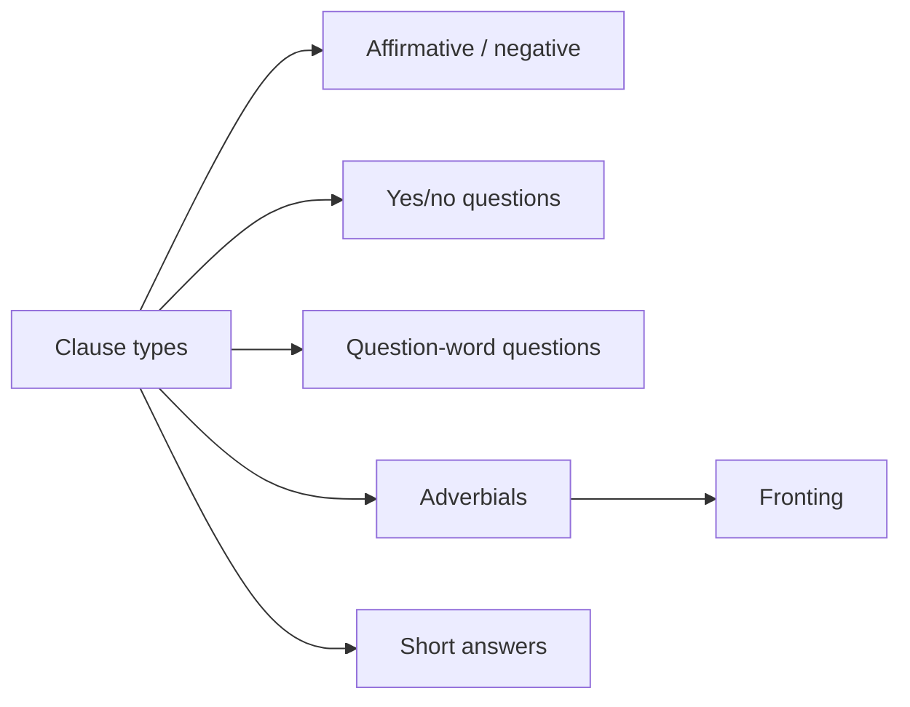

# 4 Various Types Of Clause

## Source Correspondence

This chapter introduces several basic clause types in Swedish: negative clauses, yes/no questions, question-word questions, clauses with adverbials, fronted clauses, and short answers.

## Section Navigation

| Section | Topic | Main Point |
|---|---|---|
| [[04.01 Clause Negation Inte\|4.1 Clause negation: inte]] | Negation | `inte` normally follows the verb. |
| [[04.02 Yes No Questions\|4.2 Yes/no questions]] | Yes/no questions | The verb comes first. |
| [[04.03 Question Word Questions\|4.3 Question-word questions]] | Question-word questions | Question word first, then verb. |
| [[04.04 Question Words\|4.4 Question words]] | Question words | Swedish question words usually have one form. |
| [[04.05 Another Part of the Sentence Adverbials\|4.5 Another part of the sentence: adverbials]] | Adverbials | Adverbials express place, time, manner, etc. |
| [[04.06 Fronting\|4.6 Fronting]] | Fronting | A fronted element is followed by verb + subject. |
| [[04.07 Short Answers\|4.7 Short answers]] | Short answers | Swedish uses `det gör/gjorde...` for many short answers. |

## Chapter Map

## Study Notes / Summary

### 中文总结

第 4 章集中处理分句类型和词序。核心是：瑞典语用词序表达很多句法功能。否定词 `inte` 通常放在动词后；一般疑问句动词在句首；疑问词问句为疑问词 + 动词；前置成分后仍要保持动词在主语前。

### 学习建议

- 每种句型都用表格标出 `subject / verb / object / adverbial`。
- 先掌握正常词序，再学习 fronting。
- 短答要单独练，因为瑞典语需要 `det`。
