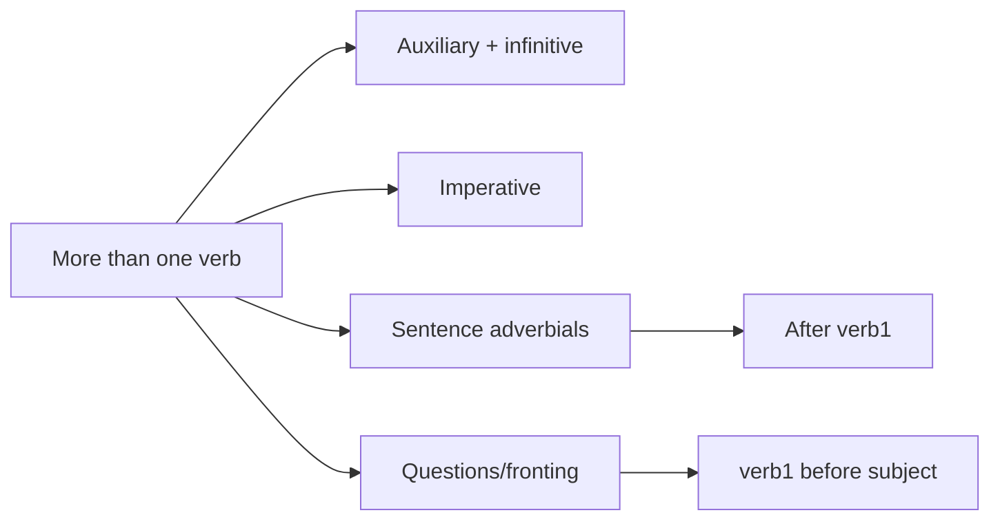

# 6 Commands And Clauses With More Than One Verb

## Source Correspondence

This chapter explains how Swedish handles clauses containing two or more verbs. It introduces auxiliary verbs, infinitives, imperatives, polite requests, and the word order of clauses where a first verb is followed by another verb.

## Section Navigation

| Section | Topic | Main Point |
|---|---|---|
| [[06.01 Two Or More Verbs In Succession\|6.1 Two or more verbs in succession]] | Verb chains | The first verb is finite; the second is infinitive. |
| [[06.02 Making The Infinitive From The Present\|6.2 Making the infinitive from the present]] | Infinitive formation | `-ar` and `-er` verbs form infinitives differently. |
| [[06.03 Some Common Auxiliary Verbs\|6.3 Some common auxiliary verbs]] | Auxiliaries | Auxiliary verbs come before main verbs. |
| [[06.04 Commands The Imperative\|6.4 Commands. The imperative]] | Imperative | Commands use a special verb form. |
| [[06.05 Commands Requests And Politeness Phrases\|6.5 Commands, requests and politeness phrases]] | Politeness | `är du snäll` and `var snäll och` soften commands. |
| [[06.06 Word Order In Clauses With More Than One Verb\|6.6 Word order in clauses with more than one verb]] | Word order | Extra verbs are placed after the first verb. |
| [[06.07 Sentence Adverbials\|6.7 Sentence adverbials]] | Sentence adverbials | Words like `inte`, `alltid`, `aldrig` follow the first verb. |
| [[06.08 Yes No Questions With More Than One Verb\|6.8 Yes/no questions with more than one verb]] | Questions | The first verb moves before the subject. |
| [[06.09 Question Word Questions And Fronting With More Than One Verb\|6.9 Question-word questions and fronting with more than one verb]] | Fronting and questions | `X/question word + verb1 + subject`. |

## Chapter Map

## Study Notes / Summary

### 中文总结

第 6 章的核心是多动词结构。瑞典语中第一个动词是有限动词，后面的动词通常是不定式。句子副词如 `inte`、`alltid`、`aldrig` 放在第一个动词后。疑问句和前置结构中移动的是第一个动词。

### 学习建议

- 用 `verb1 + infinitive` 的方式标记多动词句。
- 单独背常见 auxiliary verbs：`kan`, `vill`, `får`, `måste`, `ska`, `bör`, `brukar`, `behöver`。
- 区分命令式、请求和一般疑问句。
