# 7 Complex Sentences

## Source Correspondence

This chapter explains how clauses combine into complex sentences. It distinguishes coordination from subordination, introduces main and subordinate clauses, and gives the first rules for subordinate-clause word order.

## Section Navigation

| Section | Topic | Main Point |
|---|---|---|
| [[07.01 Coordination And Subordination\|7.1 Coordination and subordination]] | Joining clauses | Clauses can be coordinated or subordinated. |
| [[07.02 Main Clause And Subordinate Clause\|7.2 Main clause and subordinate clause]] | Clause types | A sentence needs at least one main clause. |
| [[07.03 Att Clauses\|7.3 Att clauses]] | `att` clauses | `att` clauses often act as objects. |
| [[07.04 Adverbial Clauses\|7.4 Adverbial clauses]] | Adverbial subclauses | Subordinate clauses can act as adverbials. |
| [[07.05 Word Order In Subordinate Clauses\|7.5 Word order in subordinate clauses]] | Subordinate word order | Sentence adverbials precede the verb in subclauses. |
| [[07.06 Relative Clauses\|7.6 Relative clauses]] | Relative clauses | Swedish relative clauses use `som`. |

## Chapter Map

```mermaid
flowchart LR
  A["Complex sentence"] --> B["Coordination"]
  A --> C["Subordination"]
  C --> D["Main clause"]
  C --> E["Subordinate clause"]
  E --> F["att clause"]
  E --> G["Adverbial clause"]
  E --> H["Relative clause"]
```

## Study Notes / Summary

### 中文总结

第 7 章处理复合句。并列 `coordination` 是两个同等分句连接；从属 `subordination` 是一个分句嵌入另一个分句。瑞典语从句中的句子副词位置与主句不同，这是本章最重要的词序规则。

### 学习建议

- 每个复合句先标出 main clause 和 subordinate clause。
- 看到 `att`, `när`, `om`, `eftersom`, `som` 等词时，优先判断是否引出从句。
- 从句中重点检查句子副词位置。
